# Séminaire — Apprentissage incrémental embarqué : coût, quantification et fidélité PC ↔ board

**Projet CL-Embedded** — Léonard Rivals (ISAE-SUPAERO / ENAC / Edge Spectrum)
Board de travail : **NUCLEO-F439ZI** (Cortex-M4 @ 180 MHz, 256 Ko SRAM, pas de NPU, FP32).

> Toutes les figures sont générées par [`seminaire_plots.ipynb`](seminaire_plots.ipynb) à partir de
> `experiments/` — **aucune valeur n'est saisie à la main** (règle projet). L'énergie reste « à mesurer »
> tant que la sonde PowerShield LPM01A n'a pas tourné.

## Fil conducteur — le triple gap

| Gap | Question | Où on l'attaque ici |
|-----|----------|---------------------|
| **Gap 1** | Données industrielles réelles de séries temporelles | CMAPSS, CWRU, Pronostia, Paderborn, Monitoring, Battery |
| **Gap 2** | Fonctionner sous 100 ms / RAM contrainte, **chiffres mesurés** | Latences board DWT, `.bss` (Sprints 32-35, 39) |
| **Gap 3** | Quantification INT8 **pendant** l'apprentissage incrémental | Sprints 33, 34, **39** (le cœur du séminaire) |

Quatre études préparatoires (Sprints 32-35) posent le décor **coût / seuil / features / Q15** ; le
**Sprint 39** referme le dernier point ouvert du Gap 3 : *pourquoi l'INT8 embarqué dégradait la
performance, et comment le corriger — validé sur board réelle*.

---

# 1. Sprint 32 — Impact du seuil de labélisation RUL → `faulty`

**Problème.** Sur les datasets à RUL (CMAPSS, Pronostia, Battery), le passage de la RUL continue à un
label binaire `faulty` dépend d'un **seuil** — un hyperparamètre non tranché (`TODO(arnaud)`). On balaie
5 seuils × 4 modèles × 3 datasets, sur **PC (60 runs)** et **board (60 runs)**.

Le seuil déplace mécaniquement la proportion de positifs, donc la difficulté de la tâche :

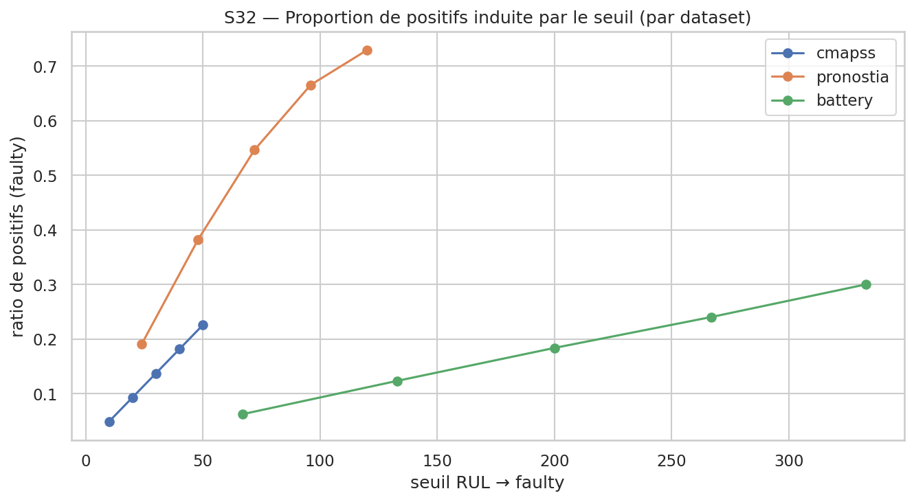

**Effet sur la performance CL** (accuracy finale, oubli AF, backward transfer) : la sensibilité au seuil
diffère nettement selon le modèle et le dataset.

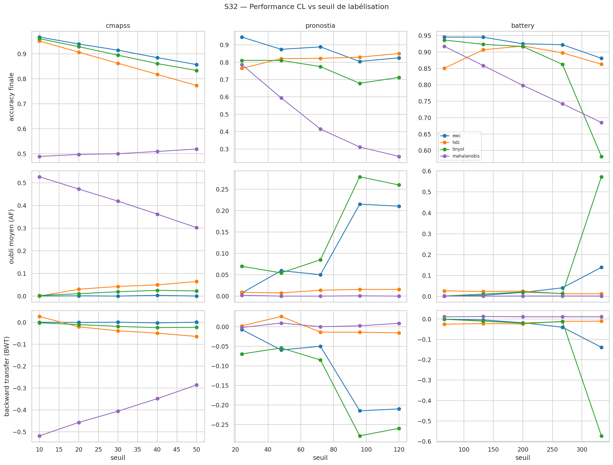

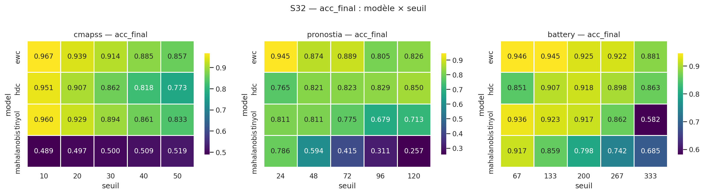

**Résultat matériel clé — invariance HW.** Le firmware est **agnostique au seuil** : la latence board et
l'empreinte `.bss` sont **constantes** quel que soit le seuil (écart-type intra-modèle ≈ 0). La latence
reste des ordres de grandeur sous les 100 ms (**Gap 2 ✅**).

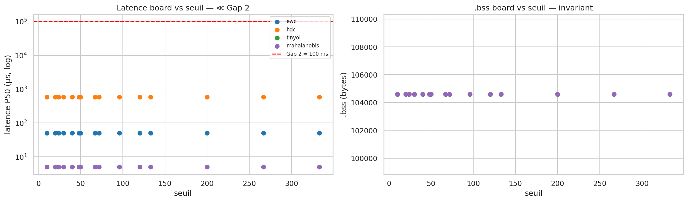

**À retenir.** Le seuil est un levier de *performance* (côté données/modèle) sans **aucun** coût matériel
— le choix peut se faire librement sans contrainte d'embarqué.

---

# 2. Sprint 33 — Profilage énergétique & métriques de coût

**Problème.** Comparer les modèles ne se limite pas à l'accuracy : il faut **le coût** — calcul, mémoire,
latence, et à terme l'énergie/autonomie.

**Coût de calcul (analytique réel).** FLOPs, paramètres, et **BOPs** (Bit-Operations). Le ratio théorique
BOPs FP32/INT8 = (32/8)² = **16×** est le gain quantitatif honnête de l'INT8 — indépendant du matériel.

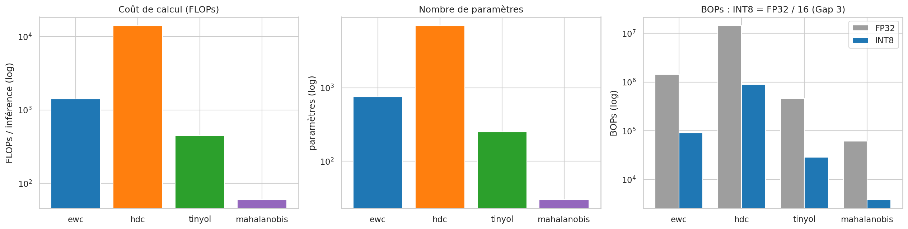

**Coût matériel (board réelle).** Latence d'inférence vs inférence + mise à jour CL. Même le pire cas
(HDC + update) reste **≪ 100 ms** — marges de ×20 000 (Maha) à ×160 (HDC).

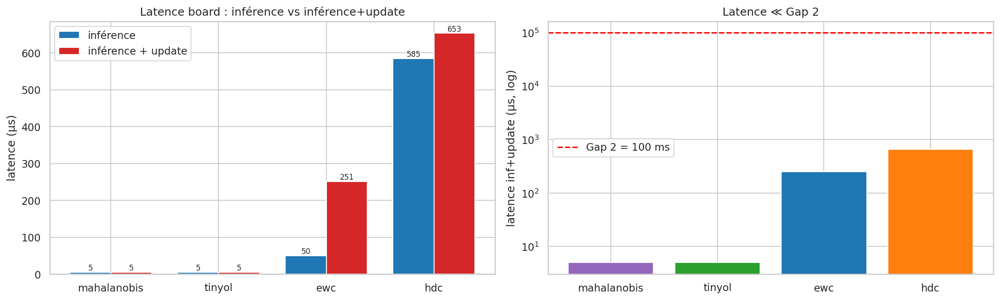

**Coût mémoire & perf PC.**

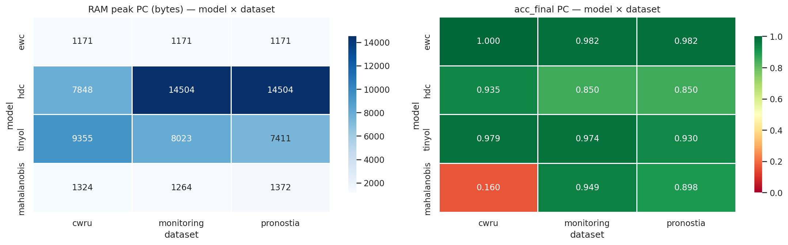

**Énergie & autonomie — structure prête, valeurs « à mesurer ».** La chaîne de calcul (segmentation par
phase via marqueur GPIO PA8, intégration µJ, autonomie = Capacité/I_moy) est **fonctionnelle et testée
bout-en-bout**, mais **aucun chiffre n'est écrit** tant que la sonde LPM01A n'a pas tourné (règle « aucun
chiffre inventé »).

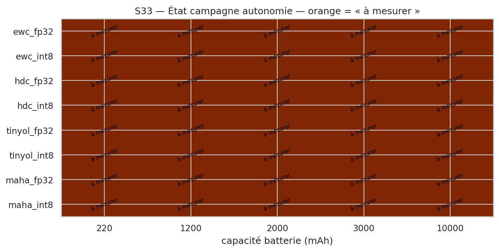

**Lien Gap 3 (question ouverte).** L'INT8 réduit la RAM (×4) et les BOPs (×16) mais **n'accélère pas** la
latence sur FPU Cortex-M4 (le kernel déquantifie en interne) — la question de l'énergie réelle reste
ouverte, en attente de µJ mesurés.

---

# 3. Sprint 34 — Streaming/buffer & Q15 pour Mahalanobis

## Partie A — Streaming temps réel

**Problème.** En exploitation, les échantillons arrivent en flux ; il faut garantir une **marge temps-réel**
(le débit d'inférence dépasse-t-il le débit demandé ?) sans exploser le buffer mémoire.

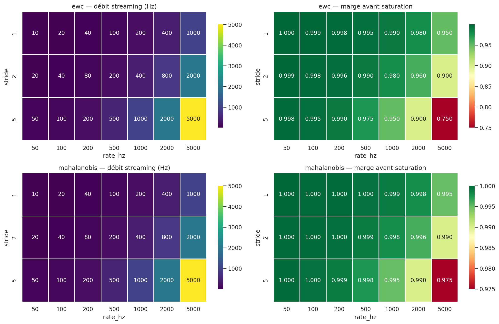

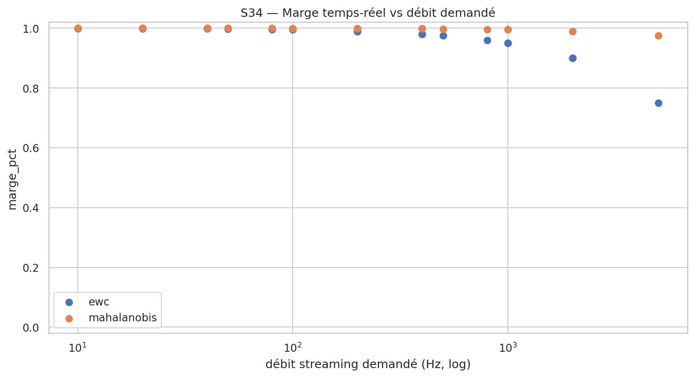

Le buffer de streaming croît linéairement avec la fenêtre W (`W × 16 × 4 B`) — coût borné et prévisible :

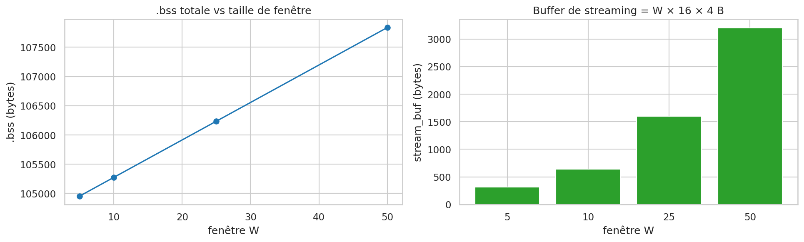

## Partie B — Q15 pour Mahalanobis (réponse au `TODO(arnaud)` du Sprint 28)

**Problème.** Au Sprint 28, l'INT8 dégradait le détecteur de Mahalanobis sur les datasets à **grande
dynamique de Σ⁻¹** (l'INT8 écrase les grandes valeurs → distances collapsées). Le **Q15** (int16, `mu` INT8
+ `sigma_inv` Q15) reconstruit Σ⁻¹ ~256× mieux pour **÷2 de RAM seulement**.

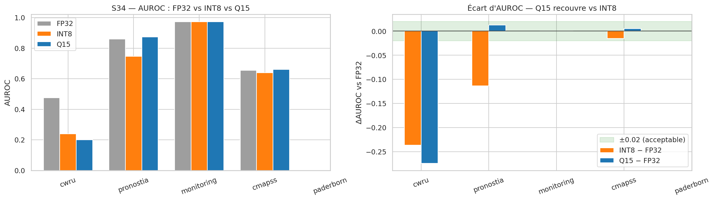

Le Q15 **récupère l'AUROC** dans la zone de tolérance ±0.02 là où l'INT8 échoue (Pronostia : ΔAUROC INT8
−0.113 → Q15 +0.013), et améliore franchement la **fidélité de rang** au FP32 :

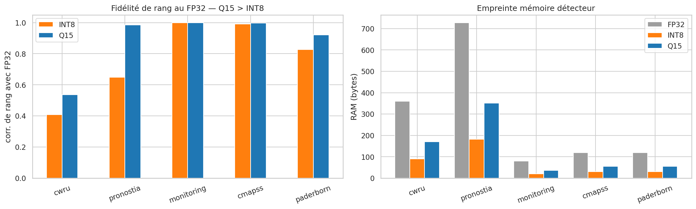

**Validation board (S3408).** Parité board ↔ PC **exacte** (300/300 prédictions), latence P50 ≈ 5 µs
(**Gap 2 ✅**), `.bss` +80 B.

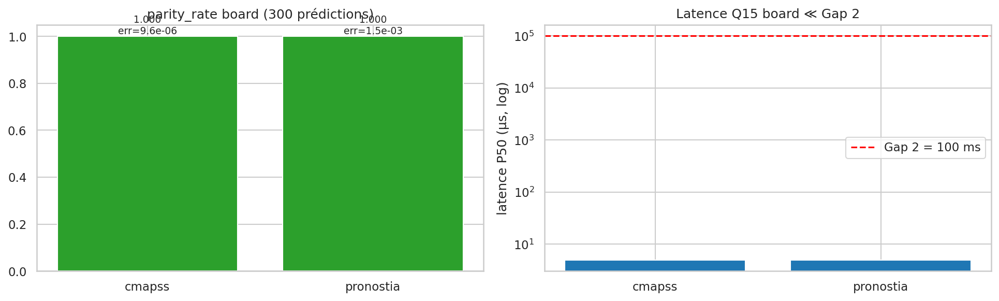

**À retenir.** Le Q15 est le **repli ciblé** quand l'INT8 8-bit ne suffit pas (grande dynamique) — nuance
importante pour le Sprint 39.

---

# 4. Sprint 35 — Impact du nombre de features

**Problème.** Combien de features embarquer ? On compare `5feat` (défaut board) / `all` (dims natives) /
`best` (sélection par modèle), sur 4 modèles × 5 datasets, PC + board.

**Message central : l'accuracy est trompeuse ⇒ lire le F1_faulty.** Les heatmaps de F1 révèlent des
décrochages invisibles en accuracy (ex. HDC board prédit la classe majoritaire → accuracy correcte,
F1_faulty nul).

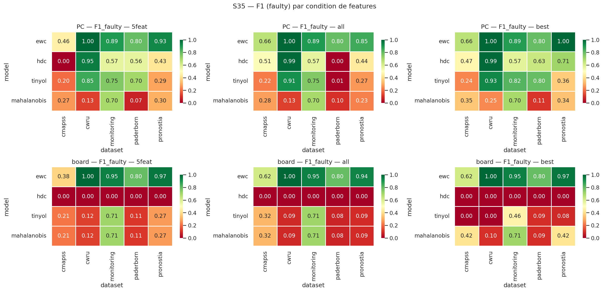

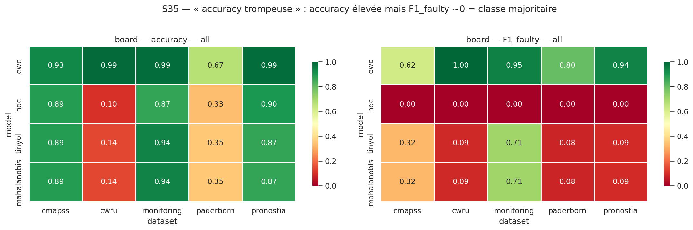

**Gain de features.** Passer à `all`/`best` aide surtout EWC × CMAPSS/Pronostia (F1 board CMAPSS 0.38→0.62),
mais n'est pas universel :

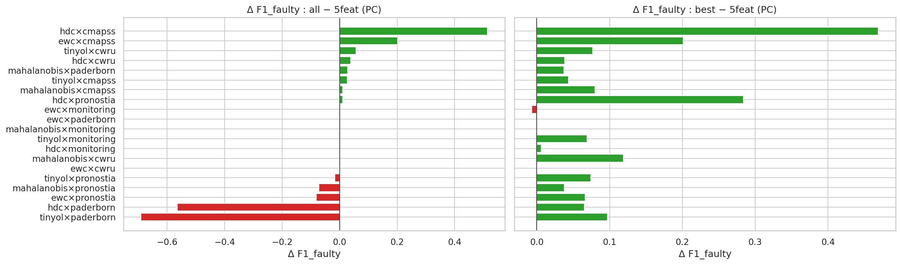

**Coût board.** `.bss` et latence croissent avec le nombre de features mais restent **≪ 100 ms** (**Gap 2
préservé**) ; `.bss` max ~184 Ko (70 % des 256 Ko).

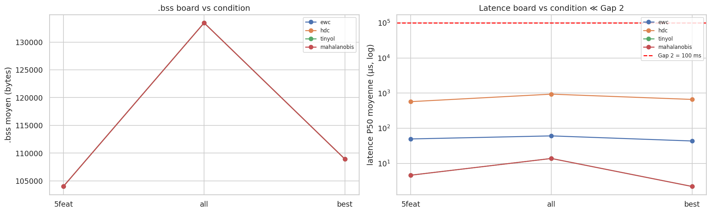

**À retenir.** Recommandation : `5feat` par défaut, `best`/`all` **ciblé** (CMAPSS/Pronostia). Paderborn
est class-incremental mono-classe/tâche → seul EWC tient.

---

# 5. Sprint 39 — INT8 vs FP32 : diagnostic, correction et validation board

> C'est le cœur du séminaire : on referme le dernier point ouvert du **Gap 3**, et on rend la comparaison
> **PC ↔ board scientifiquement fondée**.

## 5.1 Le problème historique — et pourquoi les anciennes comparaisons étaient trompeuses

Le Gap 3 était comblé sur la **RAM** (×4) mais deux faits restaient mal compris :

- le QAT PC (Sprint 28) **préservait** la métrique (Δ ≤ 0.006) ;
- la PTQ embarquée (Sprint 36) **s'effondrait** (F1 EWC 0.92 → 0.07–0.15, AUROC 0.25 vs 0.63).

**Le piège.** On juxtaposait « PC INT8 = 0.92 » et « board INT8 = 0.14 » comme s'il s'agissait du même
calcul porté avec un bug. **Ce sont deux algorithmes différents** :

| Côté | Schéma INT8 *réellement* exécuté |
|------|----------------------------------|
| Sprint 28 « PC » | QAT fake-quant : scales **par-canal calibrés**, déquantification vers FP32 |
| Sprint 36 « board » | PTQ : échelle **fixe `1/128`**, accumulateur **int16** |

Les comparer, c'était comparer des pommes et des oranges. La comparaison n'était **pas valide**.

## 5.2 Méthode « maison » sans carte — l'émulateur bit-exact

Faute de carte disponible en début de sprint, on construit un **émulateur Python bit-exact du chemin C**
(accumulateur, décalage `>>7`, quantif Q7 `1/128`). Il reproduit la dégradation board **sans flasher**, et
permet l'ablation chiffrée + le balayage de schémas intermédiaires au PC.

## 5.3 Ablation — attribuer la perte facteur par facteur

On active un seul correctif à la fois le long de l'échelle
`legacy_c → fix_acc32 → per_tensor_calib → per_channel_int8 → q15` :

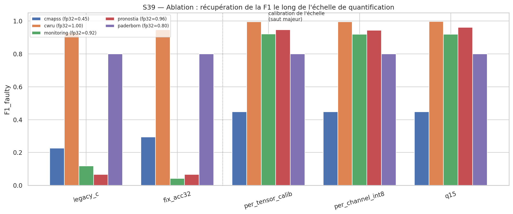

**Résultat-clé, contre-intuitif.** La cause racine est l'**échelle `1/128` non calibrée**, **pas** l'overflow
int16 :

- `fix_acc32` (accumulateur int32) seul n'apporte quasi rien (Pronostia +0.0004, Monitoring **−0.076**) ;
- `per_tensor_calib` (échelle calibrée) récupère l'essentiel : **+0.88** sur Monitoring et Pronostia ;
- `per_channel` et `q15` n'ajoutent presque rien au-delà sur ces têtes 5→32→16→2 (dynamique de poids
  homogène) — contrairement à Mahalanobis grande dynamique où le Q15 était nécessaire (Sprint 34).

> **Message manuscrit** : le correctif à fort impact est **calibrer l'échelle à l'export** (miroir du QAT
> PC), pas d'abord passer en int32.

## 5.4 Campagne trade-off — 4 modèles × 5 datasets × schémas

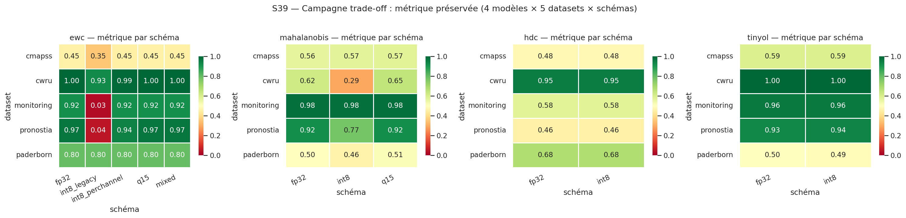

Sur EWC, l'`int8_legacy` s'effondre (Monitoring **0.916 → 0.027**, Pronostia **0.967 → 0.045**) puis
`int8_perchannel` **récupère ≈ FP32** (0.915, 0.944) ; Q15 idem. Sur Mahalanobis, l'INT8 dégrade
(Pronostia 0.921 → 0.774) et le **Q15 récupère** (0.921).

Le trade-off compression RAM vs préservation de métrique résume le Gap 3 : le bon schéma reste dans la bande
±0.02 **tout en gagnant** ×4 (per-canal) ou ×2 (Q15) de RAM ; seul `int8_legacy` tombe hors bande.

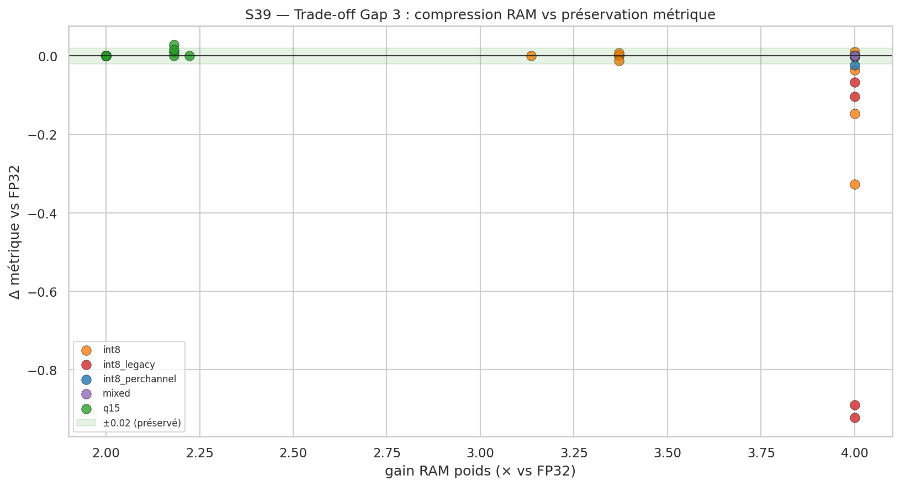

## 5.5 Ce qui rend la comparaison PC ↔ board *enfin* pertinente (S3918/S3919)

Une comparaison INT8 PC ↔ board n'est légitime que si **les deux côtés exécutent le même calcul, sur les
mêmes données, avec la même métrique**. Le Sprint 39 impose cinq règles :

1. **Même algorithme** — le côté PC est l'**émulateur du chemin board exact** (v1 ou v2), **jamais** le
   modèle QAT S28.
2. **Mêmes données** — source unique `load_condition_arrays` : mêmes colonnes, même ordre, même
   normalisation, même quantif d'entrée `float_to_q7`.
3. **Mêmes poids** — un **unique checkpoint FP32 dumpé** alimente l'export header C *et* l'émulateur.
4. **Même métrique** — `compute_fault_f1` partagé, aucune redéfinition.
5. **Deux régimes de parité distingués honnêtement** :
   - **inférence gelée** (frozen) → parité **bit-exacte** attendue (chemin entier déterministe) ;
   - **online** (SGD) → accord **approché** seulement (float32 board ≠ float64 PC), cause nommée.

**Conséquence méthodologique.** Comme le calcul est identique des deux côtés, tout écart résiduel de F1
board ↔ émulateur ne peut venir **que** du sous-échantillon streamé (300 éch.) ≠ split complet — **jamais**
d'une divergence de calcul. C'est exactement ce que confirme la parité gelée **bit-exacte = 1.000
(0 mismatch)** sur les 5 cellules board. On sort définitivement du mythe du « bug de portage ».

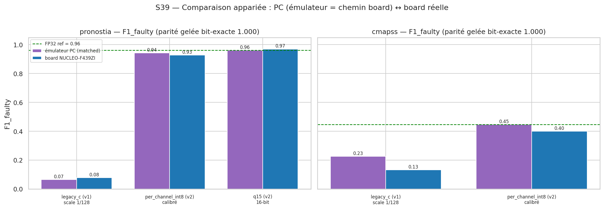

Le graphe ci-dessus superpose, par schéma, la F1 de l'**émulateur PC (matched)** et celle du **board
réel** : elles coïncident (aux 300 éch. près), et l'écart au FP32 raconte l'histoire — `legacy_c` s'effondre,
`per_channel_int8` et `q15` reviennent à la référence.

## 5.6 Validation board réelle — la F1 se récupère sur le matériel (S3915/S3916)

Le point décisif : le correctif n'est pas qu'une simulation PC. Sur **NUCLEO-F439ZI réelle**, le kernel v2
récupère la F1 **mesurée matériellement** :

- Pronostia : **0.078 → 0.928** (per-canal), **0.970** (Q15) ;
- CMAPSS : **0.133 → 0.400** (per-canal).

Le coût du correctif est négligeable : latence P50 53 µs (v1) → 67–75 µs (v2), `.bss` +1–2 Ko, **0 erreur
CRC**, **Gap 2 ✅** (≪ 100 ms).

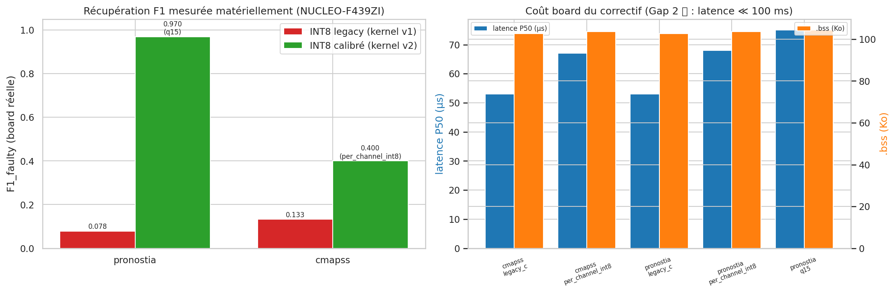

**Pourquoi la métrique se rétablit.** L'accord des prédictions vs FP32 (sur split complet, émulateur
apparié) montre la mécanique : `legacy_c` prédit *à côté* (accord effondré à 0.84 sur Pronostia → F1 chute),
tandis que `per_channel` / `q15` / `mixed` retrouvent un accord de **0.99–1.00**.

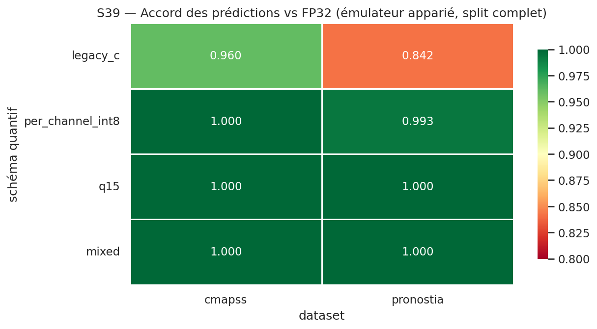

## 5.7 Synthèse Sprint 39

| Question | Réponse (chiffrée, mesurée) |
|----------|-----------------------------|
| Cause de la perte INT8 board ? | Échelle **`1/128` non calibrée** (pas l'overflow int16) — ablation `per_tensor_calib` = +0.88 |
| Correctif ? | **Calibrer l'échelle** (per-canal, kernel v2) ; Q15 en repli grande dynamique |
| Ça marche sur board ? | **Oui** : Pronostia 0.078→0.928, CMAPSS 0.133→0.400, **parité gelée 1.000**, Gap 2 ✅ |
| Comparaison PC↔board fiable ? | **Oui désormais** : même algorithme / données / métrique / poids ; régimes de parité distingués |

---

# 6. Conclusion transversale

- **Gap 2** est tenu partout : toutes les latences board mesurées (µs à ms) sont **≪ 100 ms**, quel que soit
  le seuil (S32), le nombre de features (S35) ou le schéma de quantification (S39).
- **Gap 3** est désormais **compris et corrigé** : l'INT8 gagne ×4 de RAM mais **n'accélère pas** la latence
  FPU (question énergie ouverte, S33) ; la perte de métrique venait d'une **échelle non calibrée**, pas de la
  précision 8-bit — corrigée par calibration (kernel v2), **validée sur board réelle** (S39). Le **Q15** reste
  le repli ×2 ciblé pour la grande dynamique (Mahalanobis, S34).
- **Contribution méthodologique** : une comparaison PC ↔ board d'un modèle quantifié n'a de sens qu'avec
  **le même calcul des deux côtés** (émulateur bit-exact = chemin C) et une **distinction explicite des
  régimes de parité** (gelé bit-exact vs online approché). C'est ce qui transforme « des chiffres proches »
  en **preuve**.

## Reste ouvert
- **µJ réels** (sonde LPM01A) → énergie/autonomie (S33, `TODO(dorra)`).
- **SIMD CMSIS-NN** (`arm_dot_prod_q7`) pour tenter d'accélérer l'INT8 sur Cortex-M4 (S3917, différé,
  `TODO(dorra)` toolchain).

---

*Figures régénérables via `jupyter nbconvert --to notebook --execute --inplace docs/PresentationJuillet/seminaire_plots.ipynb`.*
