# 🧪 Suivi des Expériences (Experiments Tracker)

Ce document fournit une vue d'ensemble de toutes tes expériences. Il a été conçu pour être **simple à comprendre** au premier coup d'œil et **facile à mettre à jour**.

> Généré automatiquement le 2026-04-29 11:02 par `scripts/generate_tracker.py`.

--- 

## 🌳 Vue Arborescente (Graphe Mermaid)

```mermaid
graph LR
    classDef dataset fill:#e1bee7,stroke:#8e24aa,stroke-width:2px,color:#000;
    classDef scenario fill:#bbdefb,stroke:#1e88e5,stroke-width:2px,color:#000;
    classDef run_success fill:#c8e6c9,stroke:#43a047,stroke-width:1px,color:#000;
    classDef run_fail fill:#ffcdd2,stroke:#e53935,stroke-width:1px,color:#000;

    Root[🔍 Expériences CL]

    Root --> DS_0[Equipment]:::dataset
    DS_0 --> SC_0_0[monitoring_by_equipment]:::scenario
    SC_0_0 --> M_0_0_0[ewc 🟢]:::run_success
    SC_0_0 --> M_0_0_1[hdc 🟢]:::run_success
    SC_0_0 --> M_0_0_2[unsupervised 🔴]:::run_fail
    SC_0_0 --> M_0_0_3[mahalanobis 🔴]:::run_fail
    SC_0_0 --> M_0_0_4[dbscan 🔴]:::run_fail
    SC_0_0 --> M_0_0_5[tinyol 🟢]:::run_success
    SC_0_0 --> M_0_0_6[kmeans 🔴]:::run_fail
    SC_0_0 --> M_0_0_7[kmeans 🟢]:::run_success
    SC_0_0 --> M_0_0_8[mahalanobis 🟢]:::run_success
    SC_0_0 --> M_0_0_9[ewc 🟢]:::run_success
    SC_0_0 --> M_0_0_10[hdc 🟢]:::run_success
    SC_0_0 --> M_0_0_11[dbscan 🟢]:::run_success
    DS_0 --> SC_0_1[dataset2]:::scenario
    SC_0_1 --> M_0_1_0[unsupervised 🔴]:::run_fail
    DS_0 --> SC_0_2[monitoring_by_location]:::scenario
    SC_0_2 --> M_0_2_0[ewc 🟢]:::run_success
    SC_0_2 --> M_0_2_1[hdc 🟢]:::run_success
    SC_0_2 --> M_0_2_2[tinyol 🟢]:::run_success
    SC_0_2 --> M_0_2_3[mahalanobis 🔴]:::run_fail
    SC_0_2 --> M_0_2_4[kmeans 🔴]:::run_fail
    SC_0_2 --> M_0_2_5[dbscan 🔴]:::run_fail
    SC_0_2 --> M_0_2_6[kmeans 🟢]:::run_success
    SC_0_2 --> M_0_2_7[mahalanobis 🟢]:::run_success
    SC_0_2 --> M_0_2_8[ewc 🟢]:::run_success
    SC_0_2 --> M_0_2_9[hdc 🟢]:::run_success
    SC_0_2 --> M_0_2_10[dbscan 🟢]:::run_success
    DS_0 --> SC_0_3[monitoring_single_task]:::scenario
    SC_0_3 --> M_0_3_0[ewc 🟢]:::run_success
    SC_0_3 --> M_0_3_1[hdc 🟢]:::run_success
    SC_0_3 --> M_0_3_2[tinyol 🟢]:::run_success
    SC_0_3 --> M_0_3_3[kmeans 🟢]:::run_success
    SC_0_3 --> M_0_3_4[mahalanobis 🟢]:::run_success
    SC_0_3 --> M_0_3_5[dbscan 🟢]:::run_success
    DS_0 --> SC_0_4[monitoring_anomaly_detection]:::scenario
    SC_0_4 --> M_0_4_0[hdc 🟢]:::run_success
    SC_0_4 --> M_0_4_1[kmeans 🟢]:::run_success
    SC_0_4 --> M_0_4_2[mahalanobis 🟢]:::run_success
    DS_0 --> SC_0_5[ae_monitoring_anomaly_detection]:::scenario
    SC_0_5 --> M_0_5_0[tinyol 🟢]:::run_success
    Root --> DS_1[Pump]:::dataset
    DS_1 --> SC_1_0[pump_by_id]:::scenario
    SC_1_0 --> M_1_0_0[tinyol 🟢]:::run_success
    SC_1_0 --> M_1_0_1[ewc 🟢]:::run_success
    SC_1_0 --> M_1_0_2[hdc 🟢]:::run_success
    SC_1_0 --> M_1_0_3[mahalanobis 🔴]:::run_fail
    SC_1_0 --> M_1_0_4[kmeans 🔴]:::run_fail
    SC_1_0 --> M_1_0_5[dbscan 🔴]:::run_fail
    DS_1 --> SC_1_1[pump_temporal]:::scenario
    SC_1_1 --> M_1_1_0[tinyol 🟢]:::run_success
    SC_1_1 --> M_1_1_1[ewc 🟢]:::run_success
    SC_1_1 --> M_1_1_2[hdc 🟢]:::run_success
    SC_1_1 --> M_1_1_3[mahalanobis 🟢]:::run_success
    SC_1_1 --> M_1_1_4[kmeans 🟢]:::run_success
    SC_1_1 --> M_1_1_5[dbscan 🟢]:::run_success
    DS_1 --> SC_1_2[pump_single_task]:::scenario
    SC_1_2 --> M_1_2_0[ewc 🟢]:::run_success
    SC_1_2 --> M_1_2_1[hdc 🟢]:::run_success
    SC_1_2 --> M_1_2_2[tinyol 🟢]:::run_success
    SC_1_2 --> M_1_2_3[kmeans 🟢]:::run_success
    SC_1_2 --> M_1_2_4[mahalanobis 🟢]:::run_success
    SC_1_2 --> M_1_2_5[dbscan 🟢]:::run_success
    Root --> DS_2[Pronostia]:::dataset
    DS_2 --> SC_2_0[pronostia_no_split]:::scenario
    SC_2_0 --> M_2_0_0[ewc 🟢]:::run_success
    SC_2_0 --> M_2_0_1[hdc 🟢]:::run_success
    SC_2_0 --> M_2_0_2[tinyol 🟢]:::run_success
    SC_2_0 --> M_2_0_3[kmeans 🟢]:::run_success
    SC_2_0 --> M_2_0_4[mahalanobis 🟢]:::run_success
    SC_2_0 --> M_2_0_5[dbscan 🟢]:::run_success
    DS_2 --> SC_2_1[pronostia_by_condition]:::scenario
    SC_2_1 --> M_2_1_0[ewc 🟢]:::run_success
    SC_2_1 --> M_2_1_1[hdc 🟢]:::run_success
    SC_2_1 --> M_2_1_2[tinyol 🟢]:::run_success
    SC_2_1 --> M_2_1_3[kmeans 🔴]:::run_fail
    SC_2_1 --> M_2_1_4[mahalanobis 🔴]:::run_fail
    SC_2_1 --> M_2_1_5[dbscan 🔴]:::run_fail
    SC_2_1 --> M_2_1_6[kmeans 🟢]:::run_success
    SC_2_1 --> M_2_1_7[mahalanobis 🟢]:::run_success
    SC_2_1 --> M_2_1_8[ewc 🟢]:::run_success
    SC_2_1 --> M_2_1_9[hdc 🟢]:::run_success
    SC_2_1 --> M_2_1_10[dbscan 🟢]:::run_success
    Root --> DS_3[CWRU]:::dataset
    DS_3 --> SC_3_0[cwru_single_task]:::scenario
    SC_3_0 --> M_3_0_0[ewc 🟢]:::run_success
    SC_3_0 --> M_3_0_1[hdc 🟢]:::run_success
    SC_3_0 --> M_3_0_2[tinyol 🟢]:::run_success
    SC_3_0 --> M_3_0_3[kmeans 🟢]:::run_success
    SC_3_0 --> M_3_0_4[mahalanobis 🟢]:::run_success
    SC_3_0 --> M_3_0_5[dbscan 🟢]:::run_success
    DS_3 --> SC_3_1[cwru_by_fault_type]:::scenario
    SC_3_1 --> M_3_1_0[ewc 🟢]:::run_success
    SC_3_1 --> M_3_1_1[hdc 🟢]:::run_success
    SC_3_1 --> M_3_1_2[tinyol 🟢]:::run_success
    SC_3_1 --> M_3_1_3[kmeans 🟢]:::run_success
    SC_3_1 --> M_3_1_4[mahalanobis 🟢]:::run_success
    SC_3_1 --> M_3_1_5[dbscan 🟢]:::run_success
    SC_3_1 --> M_3_1_6[kmeans 🟢]:::run_success
    SC_3_1 --> M_3_1_7[mahalanobis 🟢]:::run_success
    SC_3_1 --> M_3_1_8[ewc 🟢]:::run_success
    SC_3_1 --> M_3_1_9[hdc 🟢]:::run_success
    DS_3 --> SC_3_2[cwru_by_severity]:::scenario
    SC_3_2 --> M_3_2_0[ewc 🟢]:::run_success
    SC_3_2 --> M_3_2_1[hdc 🟢]:::run_success
    SC_3_2 --> M_3_2_2[tinyol 🟢]:::run_success
    SC_3_2 --> M_3_2_3[kmeans 🟢]:::run_success
    SC_3_2 --> M_3_2_4[mahalanobis 🟢]:::run_success
    SC_3_2 --> M_3_2_5[dbscan 🟢]:::run_success
    SC_3_2 --> M_3_2_6[kmeans 🟢]:::run_success
    SC_3_2 --> M_3_2_7[mahalanobis 🟢]:::run_success
    SC_3_2 --> M_3_2_8[ewc 🟢]:::run_success
    SC_3_2 --> M_3_2_9[hdc 🟢]:::run_success
    DS_3 --> SC_3_3[cwru_by_fault_type_v2]:::scenario
    SC_3_3 --> M_3_3_0[kmeans 🟢]:::run_success
    SC_3_3 --> M_3_3_1[dbscan 🟢]:::run_success
    DS_3 --> SC_3_4[cwru_by_severity_v2]:::scenario
    SC_3_4 --> M_3_4_0[kmeans 🟢]:::run_success
    SC_3_4 --> M_3_4_1[dbscan 🟢]:::run_success
```

> **Légende** : 🟢 Succès / Terminé | 🔴 Échec / Absent / En cours

--- 

## 📌 Vue Tabulaire

| Dataset | Scénario | Apprentissage | Modèle | Statut | Métriques Clés | Dossier |
|---------|----------|---------------|--------|--------|----------------|---------|
| **Equipment** | monitoring_by_equipment | Supervisé | ewc | 🟢 Terminé | Avg Acc: 0.982 / AF: 0.001 | `exp_001_ewc_monitoring_by_equipment` |
| **Equipment** | monitoring_by_equipment | Supervisé | hdc | 🟢 Terminé | N/A | `exp_002_hdc_monitoring_by_equipment` |
| **Equipment** | dataset2 | Non-supervisé | unsupervised | 🔴 Échec / ⏳ En cours | N/A | `exp_005_unsupervised_dataset2` |
| **Equipment** | monitoring_by_equipment | Non-supervisé | unsupervised | 🔴 Échec / ⏳ En cours | N/A | `exp_005_unsupervised_monitoring_by_equipment` |
| **Equipment** | monitoring_by_equipment | Non-supervisé | mahalanobis | 🔴 Échec / ⏳ En cours | N/A | `exp_007_mahalanobis_monitoring_by_equipment` |
| **Equipment** | monitoring_by_equipment | Non-supervisé | dbscan | 🔴 Échec / ⏳ En cours | N/A | `exp_008_dbscan_monitoring_by_equipment` |
| **Equipment** | monitoring_by_equipment | Supervisé | tinyol | 🟢 Terminé | N/A | `exp_011_tinyol_monitoring_by_equipment` |
| **Pump** | pump_by_id | Supervisé | tinyol | 🟢 Terminé | N/A | `exp_012_tinyol_pump_by_id` |
| **Pump** | pump_by_id | Supervisé | ewc | 🟢 Terminé | Avg Acc: 0.566 / AF: 0.010 | `exp_013_ewc_pump_by_id` |
| **Pump** | pump_by_id | Supervisé | hdc | 🟢 Terminé | N/A | `exp_014_hdc_pump_by_id` |
| **Pump** | pump_by_id | Non-supervisé | mahalanobis | 🔴 Échec / ⏳ En cours | N/A | `exp_015_mahalanobis_pump_by_id` |
| **Equipment** | monitoring_by_location | Supervisé | ewc | 🟢 Terminé | Avg Acc: 0.982 / AF: 0.001 | `exp_016_ewc_monitoring_by_location` |
| **Equipment** | monitoring_by_location | Supervisé | hdc | 🟢 Terminé | N/A | `exp_017_hdc_monitoring_by_location` |
| **Equipment** | monitoring_by_location | Supervisé | tinyol | 🟢 Terminé | N/A | `exp_018_tinyol_monitoring_by_location` |
| **Equipment** | monitoring_by_location | Non-supervisé | mahalanobis | 🔴 Échec / ⏳ En cours | N/A | `exp_019_mahalanobis_monitoring_by_location` |
| **Pump** | pump_by_id | Non-supervisé | kmeans | 🔴 Échec / ⏳ En cours | N/A | `exp_020_kmeans_pump_by_id` |
| **Pump** | pump_by_id | Non-supervisé | dbscan | 🔴 Échec / ⏳ En cours | N/A | `exp_021_dbscan_pump_by_id` |
| **Equipment** | monitoring_by_location | Non-supervisé | kmeans | 🔴 Échec / ⏳ En cours | N/A | `exp_022_kmeans_monitoring_by_location` |
| **Equipment** | monitoring_by_location | Non-supervisé | dbscan | 🔴 Échec / ⏳ En cours | N/A | `exp_023_dbscan_monitoring_by_location` |
| **Pump** | pump_temporal | Supervisé | tinyol | 🟢 Terminé | N/A | `exp_024_tinyol_pump_temporal` |
| **Pump** | pump_temporal | Supervisé | ewc | 🟢 Terminé | Avg Acc: 0.512 / AF: 0.005 | `exp_025_ewc_pump_temporal` |
| **Pump** | pump_temporal | Supervisé | hdc | 🟢 Terminé | N/A | `exp_026_hdc_pump_temporal` |
| **Pump** | pump_temporal | Non-supervisé | mahalanobis | 🟢 Terminé | N/A | `exp_027_mahalanobis_pump_temporal` |
| **Pump** | pump_temporal | Non-supervisé | kmeans | 🟢 Terminé | N/A | `exp_028_kmeans_pump_temporal` |
| **Pump** | pump_temporal | Non-supervisé | dbscan | 🟢 Terminé | N/A | `exp_029_dbscan_pump_temporal` |
| **Equipment** | monitoring_single_task | Supervisé | ewc | 🟢 Terminé | Acc: 0.982 / F1: 0.905 | `exp_030_ewc_monitoring_single_task` |
| **Equipment** | monitoring_by_equipment | Non-supervisé | kmeans | 🔴 Échec / ⏳ En cours | N/A | `exp_030_kmeans_monitoring_by_equipment` |
| **Equipment** | monitoring_single_task | Supervisé | hdc | 🟢 Terminé | Acc: 0.856 / F1: 0.557 | `exp_031_hdc_monitoring_single_task` |
| **Equipment** | monitoring_single_task | Supervisé | tinyol | 🟢 Terminé | Acc: 0.945 / F1: 0.626 | `exp_032_tinyol_monitoring_single_task` |
| **Equipment** | monitoring_single_task | Non-supervisé | kmeans | 🟢 Terminé | Acc: 0.955 / F1: 0.709 | `exp_033_kmeans_monitoring_single_task` |
| **Equipment** | monitoring_single_task | Non-supervisé | mahalanobis | 🟢 Terminé | Acc: 0.957 / F1: 0.725 | `exp_034_mahalanobis_monitoring_single_task` |
| **Equipment** | monitoring_single_task | Non-supervisé | dbscan | 🟢 Terminé | Acc: 0.955 / F1: 0.709 | `exp_035_dbscan_monitoring_single_task` |
| **Pump** | pump_single_task | Supervisé | ewc | 🟢 Terminé | Acc: 0.570 / F1: 0.726 | `exp_036_ewc_pump_single_task` |
| **Pump** | pump_single_task | Supervisé | hdc | 🟢 Terminé | Acc: 0.510 / F1: 0.545 | `exp_037_hdc_pump_single_task` |
| **Pump** | pump_single_task | Supervisé | tinyol | 🟢 Terminé | Acc: 0.566 / F1: 0.667 | `exp_038_tinyol_pump_single_task` |
| **Pump** | pump_single_task | Non-supervisé | kmeans | 🟢 Terminé | Acc: 0.442 / F1: 0.067 | `exp_039_kmeans_pump_single_task` |
| **Pump** | pump_single_task | Non-supervisé | mahalanobis | 🟢 Terminé | Acc: 0.446 / F1: 0.104 | `exp_040_mahalanobis_pump_single_task` |
| **Pump** | pump_single_task | Non-supervisé | dbscan | 🟢 Terminé | Acc: 0.570 / F1: 0.726 | `exp_041_dbscan_pump_single_task` |
| **Pronostia** | pronostia_no_split | Supervisé | ewc | 🟢 Terminé | Acc: 0.960 / F1: 0.758 | `exp_044_ewc_pronostia_no_split` |
| **Pronostia** | pronostia_no_split | Supervisé | hdc | 🟢 Terminé | Acc: 0.636 / F1: 0.285 | `exp_045_hdc_pronostia_no_split` |
| **Pronostia** | pronostia_no_split | Supervisé | tinyol | 🟢 Terminé | Acc: 0.950 / F1: 0.670 | `exp_046_tinyol_pronostia_no_split` |
| **Pronostia** | pronostia_no_split | Non-supervisé | kmeans | 🟢 Terminé | Acc: 0.900 | `exp_047_kmeans_pronostia_no_split` |
| **Pronostia** | pronostia_no_split | Non-supervisé | mahalanobis | 🟢 Terminé | Acc: 0.887 | `exp_048_mahalanobis_pronostia_no_split` |
| **Pronostia** | pronostia_no_split | Non-supervisé | dbscan | 🟢 Terminé | Acc: 0.885 | `exp_049_dbscan_pronostia_no_split` |
| **Pronostia** | pronostia_by_condition | Supervisé | ewc | 🟢 Terminé | Avg Acc: 0.982 / AF: 0.000 | `exp_050_ewc_pronostia_by_condition` |
| **Pronostia** | pronostia_by_condition | Supervisé | hdc | 🟢 Terminé | N/A | `exp_051_hdc_pronostia_by_condition` |
| **Pronostia** | pronostia_by_condition | Supervisé | tinyol | 🟢 Terminé | N/A | `exp_052_tinyol_pronostia_by_condition` |
| **Pronostia** | pronostia_by_condition | Non-supervisé | kmeans | 🔴 Échec / ⏳ En cours | N/A | `exp_053_kmeans_pronostia_by_condition` |
| **Pronostia** | pronostia_by_condition | Non-supervisé | mahalanobis | 🔴 Échec / ⏳ En cours | N/A | `exp_054_mahalanobis_pronostia_by_condition` |
| **Pronostia** | pronostia_by_condition | Non-supervisé | dbscan | 🔴 Échec / ⏳ En cours | N/A | `exp_055_dbscan_pronostia_by_condition` |
| **CWRU** | cwru_single_task | Supervisé | ewc | 🟢 Terminé | Acc: 0.978 / F1: 0.988 | `exp_068_ewc_cwru_single_task` |
| **CWRU** | cwru_single_task | Supervisé | hdc | 🟢 Terminé | Acc: 0.887 / F1: 0.933 | `exp_069_hdc_cwru_single_task` |
| **CWRU** | cwru_single_task | Supervisé | tinyol | 🟢 Terminé | Acc: 0.900 / F1: 0.947 | `exp_070_tinyol_cwru_single_task` |
| **CWRU** | cwru_single_task | Non-supervisé | kmeans | 🟢 Terminé | N/A | `exp_071_kmeans_cwru_single_task` |
| **CWRU** | cwru_single_task | Non-supervisé | mahalanobis | 🟢 Terminé | N/A | `exp_072_mahalanobis_cwru_single_task` |
| **CWRU** | cwru_single_task | Non-supervisé | dbscan | 🟢 Terminé | N/A | `exp_073_dbscan_cwru_single_task` |
| **CWRU** | cwru_by_fault_type | Supervisé | ewc | 🟢 Terminé | Avg Acc: 1.000 / AF: 0.000 | `exp_074_ewc_cwru_by_fault_type` |
| **CWRU** | cwru_by_fault_type | Supervisé | hdc | 🟢 Terminé | N/A | `exp_075_hdc_cwru_by_fault_type` |
| **CWRU** | cwru_by_fault_type | Supervisé | tinyol | 🟢 Terminé | N/A | `exp_076_tinyol_cwru_by_fault_type` |
| **CWRU** | cwru_by_fault_type | Non-supervisé | kmeans | 🟢 Terminé | Avg Acc: 0.152 / AF: 0.019 | `exp_077_kmeans_cwru_by_fault_type` |
| **CWRU** | cwru_by_fault_type | Non-supervisé | mahalanobis | 🟢 Terminé | Avg Acc: 0.316 / AF: 0.013 | `exp_078_mahalanobis_cwru_by_fault_type` |
| **CWRU** | cwru_by_fault_type | Non-supervisé | dbscan | 🟢 Terminé | Avg Acc: 0.126 / AF: 0.045 | `exp_079_dbscan_cwru_by_fault_type` |
| **CWRU** | cwru_by_severity | Supervisé | ewc | 🟢 Terminé | Avg Acc: 0.952 / AF: 0.000 | `exp_080_ewc_cwru_by_severity` |
| **CWRU** | cwru_by_severity | Supervisé | hdc | 🟢 Terminé | N/A | `exp_081_hdc_cwru_by_severity` |
| **CWRU** | cwru_by_severity | Supervisé | tinyol | 🟢 Terminé | N/A | `exp_082_tinyol_cwru_by_severity` |
| **CWRU** | cwru_by_severity | Non-supervisé | kmeans | 🟢 Terminé | Avg Acc: 0.303 / AF: 0.065 | `exp_083_kmeans_cwru_by_severity` |
| **CWRU** | cwru_by_severity | Non-supervisé | mahalanobis | 🟢 Terminé | Avg Acc: 0.394 / AF: 0.091 | `exp_084_mahalanobis_cwru_by_severity` |
| **CWRU** | cwru_by_severity | Non-supervisé | dbscan | 🟢 Terminé | Avg Acc: 0.121 / AF: 0.292 | `exp_085_dbscan_cwru_by_severity` |
| **Equipment** | monitoring_anomaly_detection | Supervisé | hdc | 🟢 Terminé | Avg AUROC: 0.945 | `exp_086_hdc_monitoring_anomaly_detection` |
| **Equipment** | ae_monitoring_anomaly_detection | Supervisé | tinyol | 🟢 Terminé | Avg AUROC: 0.972 | `exp_087_tinyol_ae_monitoring_anomaly_detection` |
| **Equipment** | monitoring_anomaly_detection | Non-supervisé | kmeans | 🟢 Terminé | Avg AUROC: 0.984 | `exp_088_kmeans_monitoring_anomaly_detection` |
| **Equipment** | monitoring_anomaly_detection | Non-supervisé | mahalanobis | 🟢 Terminé | Avg AUROC: 0.988 | `exp_089_mahalanobis_monitoring_anomaly_detection` |
| **CWRU** | cwru_by_fault_type_v2 | Non-supervisé | kmeans | 🟢 Terminé | Avg Acc: 0.273 / AF: 0.208 | `exp_090_kmeans_cwru_by_fault_type_v2` |
| **CWRU** | cwru_by_severity_v2 | Non-supervisé | kmeans | 🟢 Terminé | Avg Acc: 0.450 / AF: 0.000 | `exp_091_kmeans_cwru_by_severity_v2` |
| **CWRU** | cwru_by_fault_type_v2 | Non-supervisé | dbscan | 🟢 Terminé | Avg Acc: 0.896 / AF: 0.000 | `exp_092_dbscan_cwru_by_fault_type_v2` |
| **CWRU** | cwru_by_severity_v2 | Non-supervisé | dbscan | 🟢 Terminé | Avg Acc: 0.896 / AF: 0.000 | `exp_093_dbscan_cwru_by_severity_v2` |
| **CWRU** | cwru_by_fault_type | Non-supervisé | kmeans | 🟢 Terminé | Avg Acc: 0.312 / AF: 0.065 | `exp_100_kmeans_cwru_by_fault_type` |
| **CWRU** | cwru_by_severity | Non-supervisé | kmeans | 🟢 Terminé | Avg Acc: 0.450 / AF: 0.000 | `exp_101_kmeans_cwru_by_severity` |
| **Pronostia** | pronostia_by_condition | Non-supervisé | kmeans | 🟢 Terminé | Avg Acc: 0.872 / AF: 0.059 | `exp_102_kmeans_pronostia_by_condition` |
| **CWRU** | cwru_by_fault_type | Non-supervisé | mahalanobis | 🟢 Terminé | Avg Acc: 0.160 / AF: 0.026 | `exp_103_mahalanobis_cwru_by_fault_type` |
| **CWRU** | cwru_by_severity | Non-supervisé | mahalanobis | 🟢 Terminé | Avg Acc: 0.195 / AF: 0.019 | `exp_104_mahalanobis_cwru_by_severity` |
| **Pronostia** | pronostia_by_condition | Non-supervisé | mahalanobis | 🟢 Terminé | Avg Acc: 0.898 / AF: 0.010 | `exp_105_mahalanobis_pronostia_by_condition` |
| **CWRU** | cwru_by_fault_type | Supervisé | ewc | 🟢 Terminé | Avg Acc: 1.000 / AF: 0.000 | `exp_106_ewc_cwru_by_fault_type` |
| **CWRU** | cwru_by_severity | Supervisé | ewc | 🟢 Terminé | Avg Acc: 0.952 / AF: 0.000 | `exp_107_ewc_cwru_by_severity` |
| **Pronostia** | pronostia_by_condition | Supervisé | ewc | 🟢 Terminé | Avg Acc: 0.982 / AF: 0.000 | `exp_108_ewc_pronostia_by_condition` |
| **CWRU** | cwru_by_fault_type | Supervisé | hdc | 🟢 Terminé | N/A | `exp_109_hdc_cwru_by_fault_type` |
| **CWRU** | cwru_by_severity | Supervisé | hdc | 🟢 Terminé | N/A | `exp_110_hdc_cwru_by_severity` |
| **Pronostia** | pronostia_by_condition | Supervisé | hdc | 🟢 Terminé | N/A | `exp_111_hdc_pronostia_by_condition` |
| **Equipment** | monitoring_by_equipment | Non-supervisé | kmeans | 🟢 Terminé | Avg Acc: 0.943 / AF: 0.005 | `exp_112_kmeans_monitoring_by_equipment` |
| **Equipment** | monitoring_by_equipment | Non-supervisé | mahalanobis | 🟢 Terminé | Avg Acc: 0.954 / AF: 0.000 | `exp_113_mahalanobis_monitoring_by_equipment` |
| **Equipment** | monitoring_by_equipment | Supervisé | ewc | 🟢 Terminé | Avg Acc: 0.982 / AF: 0.001 | `exp_114_ewc_monitoring_by_equipment` |
| **Equipment** | monitoring_by_equipment | Supervisé | hdc | 🟢 Terminé | N/A | `exp_115_hdc_monitoring_by_equipment` |
| **Equipment** | monitoring_by_location | Non-supervisé | kmeans | 🟢 Terminé | Avg Acc: 0.947 / AF: 0.008 | `exp_116_kmeans_monitoring_by_location` |
| **Equipment** | monitoring_by_location | Non-supervisé | mahalanobis | 🟢 Terminé | Avg Acc: 0.949 / AF: 0.001 | `exp_117_mahalanobis_monitoring_by_location` |
| **Equipment** | monitoring_by_location | Supervisé | ewc | 🟢 Terminé | Avg Acc: 0.982 / AF: 0.001 | `exp_118_ewc_monitoring_by_location` |
| **Equipment** | monitoring_by_location | Supervisé | hdc | 🟢 Terminé | N/A | `exp_119_hdc_monitoring_by_location` |
| **Equipment** | monitoring_by_equipment | Non-supervisé | dbscan | 🟢 Terminé | Avg Acc: 0.950 / AF: 0.001 | `exp_120_dbscan_monitoring_by_equipment` |
| **Equipment** | monitoring_by_location | Non-supervisé | dbscan | 🟢 Terminé | Avg Acc: 0.949 / AF: 0.002 | `exp_121_dbscan_monitoring_by_location` |
| **Pronostia** | pronostia_by_condition | Non-supervisé | dbscan | 🟢 Terminé | Avg Acc: 0.835 / AF: 0.099 | `exp_122_dbscan_pronostia_by_condition` |

--- 

## 📊 Résumé

**Total : 99 expériences — 🟢 85 terminées / 🔴 14 en cours ou échouées**

### Par dataset

| Dataset | Total | 🟢 Succès | 🔴 Échec |
|---------|-------|-----------|----------|
| Equipment | 34 | 26 | 8 |
| Pump | 18 | 15 | 3 |
| Pronostia | 17 | 14 | 3 |
| CWRU | 30 | 30 | 0 |

### Par modèle

| Modèle | Type | Total | 🟢 Succès | 🔴 Échec |
|--------|------|-------|-----------|----------|
| dbscan | Non-supervisé | 16 | 12 | 4 |
| ewc | Supervisé | 16 | 16 | 0 |
| hdc | Supervisé | 17 | 17 | 0 |
| kmeans | Non-supervisé | 19 | 15 | 4 |
| mahalanobis | Non-supervisé | 17 | 13 | 4 |
| tinyol | Supervisé | 12 | 12 | 0 |
| unsupervised | Non-supervisé | 2 | 0 | 2 |
