# Apprentissage incrémental embarqué — ce qui a été mesuré depuis juillet

**Sprints 44 → 53** · juillet – septembre 2026
Léonard Rivals — ISAE-SUPAERO (DISC) / ENAC (LII) / Edge Spectrum
Carte : **NUCLEO-F439ZI**, Cortex-M4 @ 180 MHz, 256 Ko SRAM, pas de NPU, FP32 natif.

> Toutes les figures sont régénérées depuis `experiments/` par
> `python scripts/generate_figures.py --catalog seminaire_s44_s53`.
> **Aucune valeur n'est saisie à la main.** Ce qui n'a pas été mesuré porte la mention
> littérale « à mesurer » et sa raison — jamais un zéro.

---

# 1. Dix sprints, quatre axes

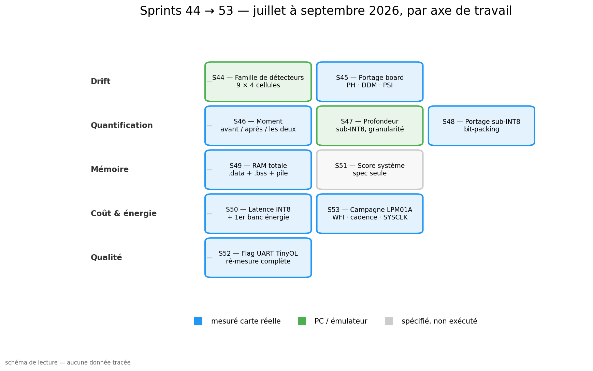

Quatre axes de travail se sont ouverts depuis juillet, plus un correctif de qualité :

- **Détection de drift** (S44 PC, S45 carte) — *quand* le modèle doit-il apprendre ?
- **Quantification** (S46 moment, S47 profondeur, S48 portage) — *comment* comprimer ?
- **Mémoire** (S49) — combien coûte réellement le modèle en RAM ?
- **Coût & énergie** (S50, S53) — combien coûte une inférence en µs et en µJ ?
- **Qualité** (S52) — un flag UART manquant rendait fausse une ligne du manuscrit.

Huit sprints sur dix reposent sur des **mesures carte réelle**. S51 (score système
composite) est **spécifié mais non exécuté** — dit tel quel, pas masqué.

---

# 2. Où chaque axe touche le triple gap

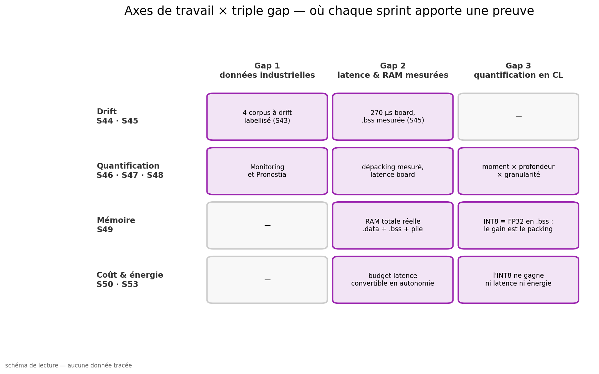

Le fil directeur du stage reste le triple gap. Chaque sprint est justifié par la case
qu'il remplit :

- **Gap 1** (données industrielles réelles) — élargi par 4 corpus à drift labellisé.
- **Gap 2** (latence et RAM mesurées) — la définition de la RAM a été **corrigée** (S49)
  et le budget de latence s'est révélé **convertible en autonomie** (S53).
- **Gap 3** (quantification pendant l'apprentissage incrémental) — trois axes balayés,
  avec une conclusion qui n'était pas celle attendue.

---

# 3. Plan

| Bloc | Slides | Message |
|---|---|---|
| 1 — Détection de drift | 4 – 8 | *Seule la mesure carte fait foi* |
| 2 — Quantification | 9 – 15 | *Le moment et la calibration dominent ; le gain sub-INT8 n'existe que packé* |
| 3 — RAM réelle | 16 – 18 | *La RAM se mesure `.data + .bss + pic de pile` ; nos chiffres antérieurs étaient sous-estimés* |
| 4 — Latence et énergie | 19 – 25 | *L'INT8 se justifie par la RAM, ni par la latence ni par l'énergie* |
| 5 — Qualité et honnêteté | 26 – 27 | *Trois résultats crédibles étaient faux ; voici comment on l'a su* |
| 6 — Bilan et suite | 28 | Ce qui reste ouvert |

---

# Bloc 1 — Détection de drift

# 4. Le socle : quatre corpus à drift labellisé (S43)

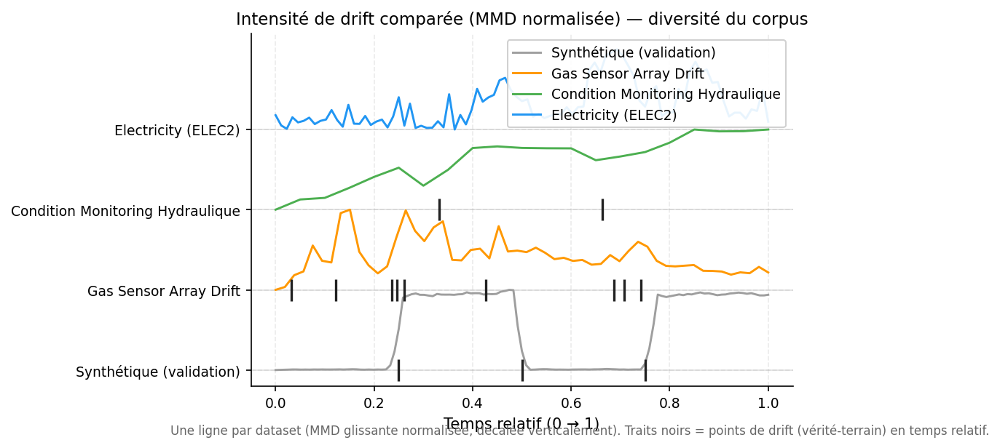

**Problème.** Jusqu'ici le modèle apprenait quand *nous* le décidions. Pour qu'il décide
seul, il faut d'abord des données où le drift est **connu**, afin de pouvoir juger un
détecteur.

Quatre corpus retenus, du plus contrôlé au plus réaliste :

| Corpus | Dimensions | Vérité-terrain |
|---|---|---|
| Synthétique | 4 | **exacte** (points imposés) — c'est le banc de validation |
| Gas Sensor Array Drift | 128 | lots d'acquisition datés |
| Hydraulic | 17 | segmentation par état du refroidisseur |
| Electricity / ELEC2 | 7 | **absente** — reportée `null`, jamais inventée |

La chaîne de caractérisation (KS, PSI, JS, MMD, Mahalanobis, PCA glissants) est validée
sur le synthétique : les pics détectés tombent **à ±1 fenêtre** des points imposés.

---

# 5. Neuf détecteurs, quatre corpus, une grille complète (S44)

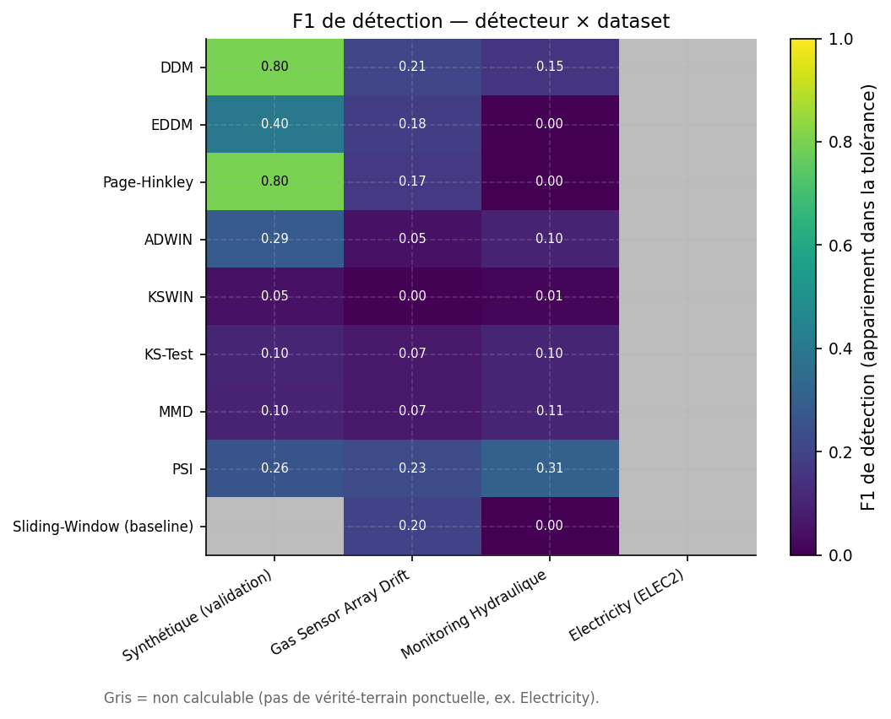

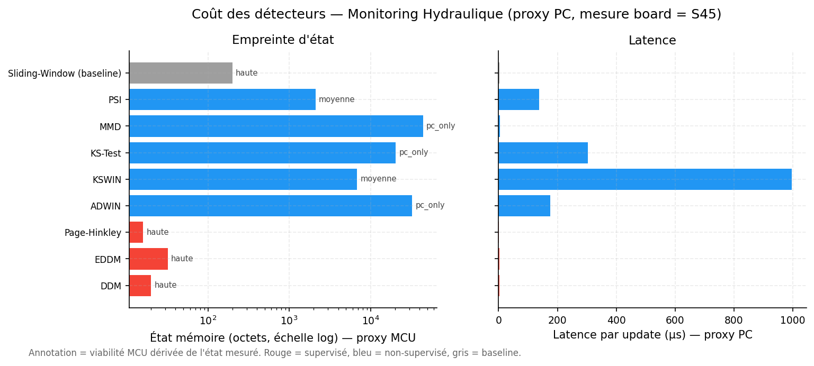

**Grille 36/36 cellules** (9 détecteurs × 4 corpus, seed 42), avec deux familles
volontairement mises à parité :

- **supervisés** — DDM, EDDM, Page-Hinkley : état **O(1)** (16 à 32 octets) ;
- **non supervisés** — ADWIN, KSWIN, KS, MMD, PSI : état croissant avec la dimension.

**Constat mesuré, et c'est lui qui tranche le portage** : le coût des non-supervisés
**croît avec la dimensionnalité**. Sur Gas Sensor (128 features), ADWIN et MMD sont
classés `pc_only` — l'état d'ADWIN atteint 245 Ko, soit l'intégralité de notre SRAM.

**Recommandation MCU** issue de la grille : Page-Hinkley, DDM, EDDM en primaires ; PSI en
non-supervisé ; MMD hors périmètre embarqué.

---

# 6. Le proxy PC ne prédit pas la carte (S45)

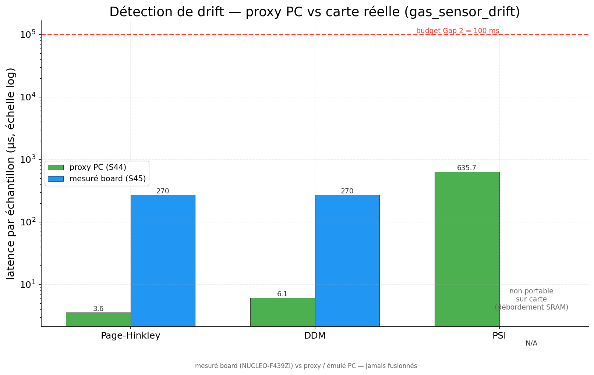

**C'est le résultat méthodologique du bloc.** Le harnais S44 estimait un coût « proxy PC »
par détecteur : **DDM ≈ 6 µs par mise à jour**. Porté et mesuré au DWT sur la carte, le
même DDM coûte **270 µs** — deux ordres de grandeur d'écart.

L'écart n'est pas une erreur du proxy : c'est le **paradoxe FPU** déjà rencontré au
Sprint 29. Le PC et le Cortex-M4 n'ont ni le même jeu d'instructions, ni la même
hiérarchie mémoire, ni le même compilateur.

**Conséquence tenue dans tout le reste du projet** : un chiffre PC n'engage jamais la
carte. Le proxy sert à **ordonner** des candidats, pas à annoncer une latence.

Le budget Gap 2 reste tenu très largement : 270 µs contre 100 ms.

---

# 7. Ce qui est portable, et ce qui ne l'est pas (S45)

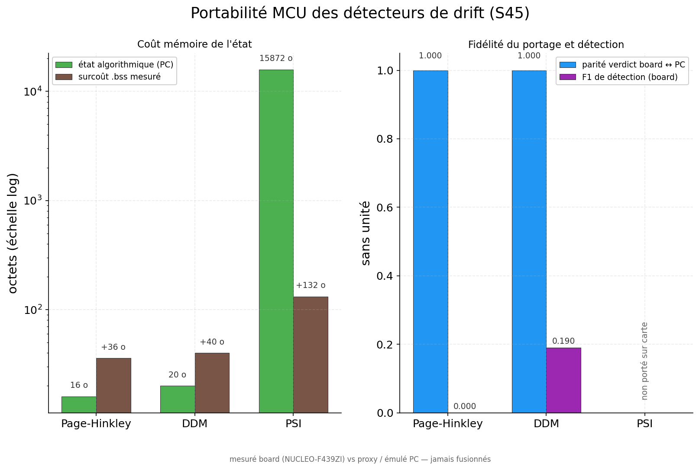

Trois détecteurs portés en C (`src/drift/`, structure statique, zéro `malloc`), intégrés
au chemin EWC du firmware par sélection à la compilation (`-DDRIFT_METHOD=…`) — le nibble
de flags du protocole UART étant saturé, le format de trame V3 reste **inchangé**.

| Détecteur | Parité verdict carte ↔ PC | Surcoût `.bss` mesuré | Verdict |
|---|---|---|---|
| Page-Hinkley | **1.000** (0 / 13 910) | +36 o | porté ✅ |
| DDM | **1.000** (0 / 13 910) | +40 o | porté ✅ |
| PSI | — | +132 o | **N/A honnête** ❌ |

**Le PSI échoue pour une raison qui n'est pas la sienne.** Son état propre tient en
132 octets. Mais son signal d'entrée est le score de Mahalanobis embarqué, dont la matrice
`sigma_inv` est en **O(k²)** : à k = 128 features, elle pèse ≈ 64 Ko et fait **déborder la
SRAM à l'édition de liens**. PSI est donc portable **en basse dimension seulement** — le
goulot est la source du signal, pas l'algorithme.

---

# 8. Bloc 1 — à retenir

1. La grille PC sert à **choisir** (familles, ordres de grandeur, coût d'état), pas à
   annoncer des performances embarquées.
2. **Parité verdict = 1.000** sur les deux détecteurs portés : la décision d'apprendre
   prise à bord est *identique* à celle qu'aurait prise le PC. C'est la condition pour que
   toute la chaîne autonome (Sprint 38) soit crédible.
3. **Une limite est un résultat** : PSI × 128 features est documenté avec son
   `na_reason`, pas effacé de la grille.
4. F1 de détection modeste (PH 0.000, DDM 0.190) : les seuils sont ceux de la littérature,
   **non réglés** sur ce flux. Le réglage est un travail PC, hors périmètre du portage.

---

# Bloc 2 — Quantification

# 9. Trois axes indépendants, et pourquoi on les sépare

« Quantifier » recouvre trois décisions distinctes, que la littérature confond souvent :

- **le moment** — avant l'entraînement (QAT), après (PTQ), ou les deux ;
- **le format** — INT8 affine, Q15, noyau v2 calibré ;
- **la profondeur et la granularité** — 8 → 4 → 2 → 1 bit, par tenseur ou par canal.

Les balayer séparément, à modèle / jeu / graine fixés, est ce qui rend chaque conclusion
**attribuable**. La contrainte transverse est la **parité bit-à-bit** entre l'émulateur PC
et la carte : sans elle, aucun chiffre PC n'engage le matériel.

---

# 10. Le moment : QAT, PTQ, ou les deux ? (S46, carte réelle)

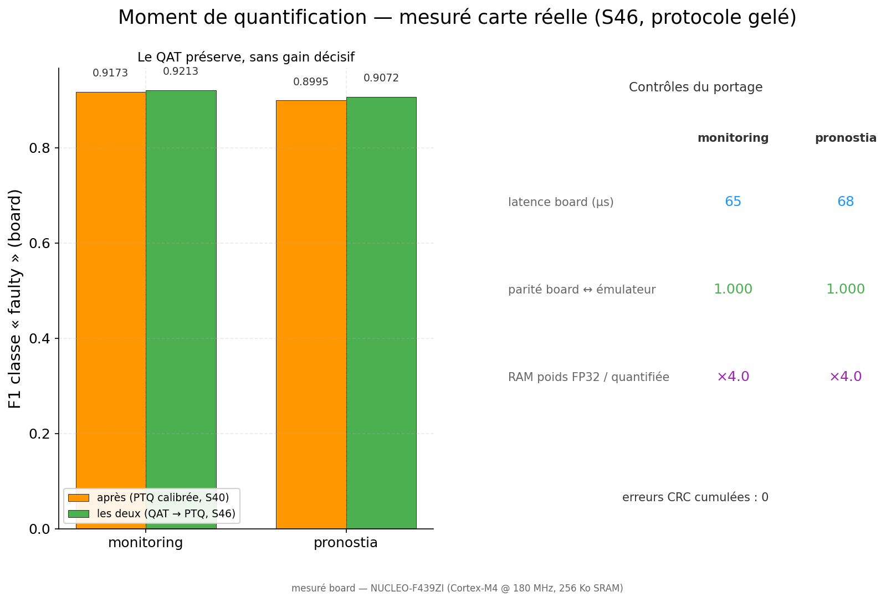

Le maillon manquant a été câblé : **`both`** = entraînement QAT, puis export PTQ vers le
noyau v2 calibré — exactement la chaîne de déploiement réelle. Mesuré carte, protocole
gelé, 0 erreur CRC :

| | après (PTQ calibrée) | les deux (QAT → PTQ) | écart |
|---|---|---|---|
| Monitoring | 0.9173 | **0.9213** | +0.004 |
| Pronostia | 0.8995 | **0.9072** | +0.0077 |

**Constat honnête, et il va contre l'intuition** : `both ≥ after`, mais de **quatre à huit
millièmes**. Sur cette tête, **c'est la calibration du noyau qui récupère l'essentiel** ;
le QAT préserve, il n'ajoute pas de gain décisif. Parité carte ↔ émulateur **1.000**,
latence 65 / 68 µs, RAM des poids **÷ 4**.

---

# 11. Ce qui décide vraiment : la calibration

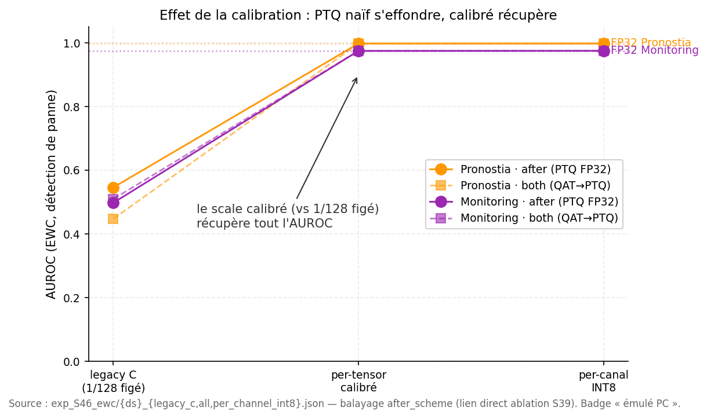

L'échelle du phénomène est ailleurs. Sur le même modèle et le même jeu :

- **PTQ naïve** (noyau historique `legacy_c`) : AUROC s'effondre à **0.498 / 0.546** —
  autrement dit, le hasard.
- **PTQ calibrée** (noyau v2, échelles par canal) : tout est récupéré.
- **QAT** : Δ ≤ 0.001.

Autrement dit : *quantifier ≠ quantifier*. Un même « INT8 » recouvre un modèle utilisable
et un modèle mort. Ce que l'on choisit, ce n'est pas « INT8 ou FP32 » — c'est **quelle
calibration**.

---

# 12. La profondeur : jusqu'où descendre ? (S47, émulateur bit-exact)

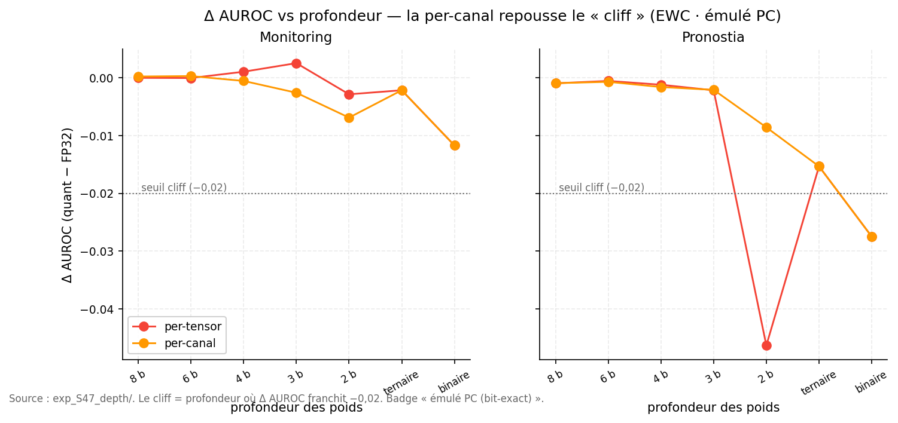

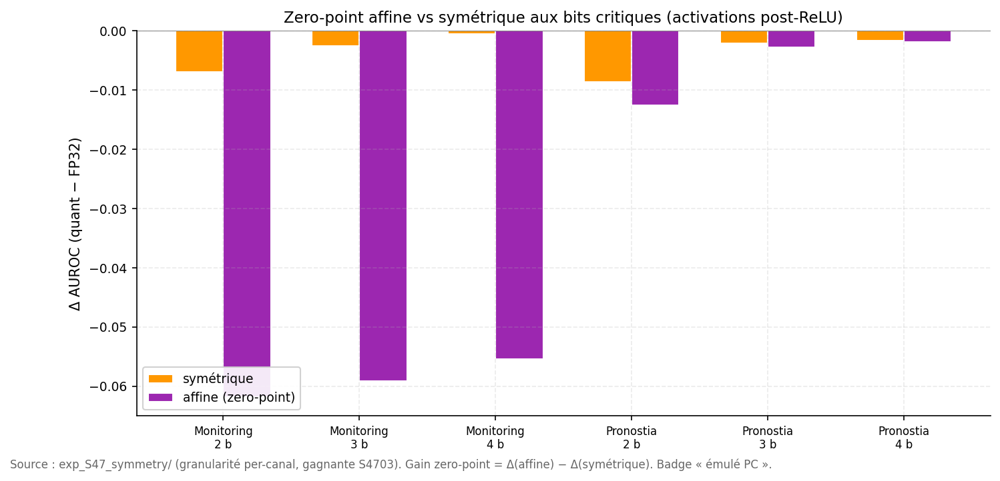

**28 cellules** (2 jeux × 7 profondeurs × 2 granularités) + **12 cellules** de symétrie,
sur l'émulateur bit-exact du noyau C. Critère : AUROC préservée à Δ ≥ −0.02.

- **Monitoring tient jusqu'au binaire** (Δ = −0.0117).
- **Pronostia casse au binaire** (Δ = −0.0275) mais **le ternaire tient** (Δ = −0.0153).
- **Le per-channel repousse le décrochage** : Pronostia à 2 bits passe de −0.046
  (per-tensor) à **−0.009** (per-channel).
- **Le zero-point affine ne rachète rien** : gain ≤ 0 sur les 12 cellules.

**Frontière retenue pour le portage : ternaire.** Le binaire reste une option agressive,
jeu-dépendante.

---

# 13. Le gain mémoire sub-INT8 n'existe que packé (S48, carte réelle)

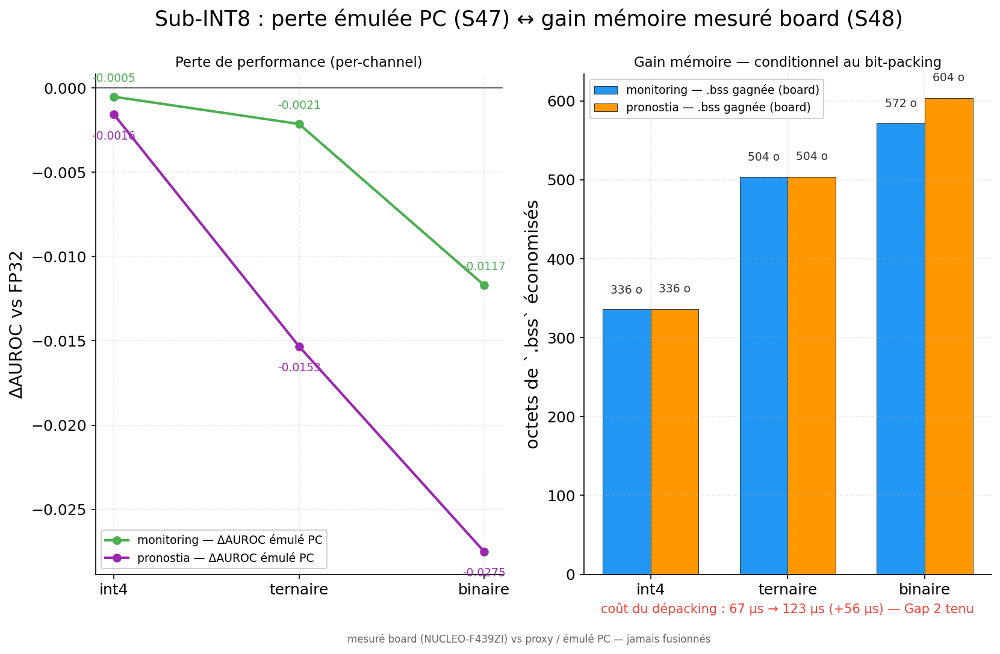

**12 cellules mesurées carte** (packé et non-packé × int4/ternaire/binaire × 2 jeux),
**parité carte ↔ émulateur = 1.000** sur les 12 (`max_score_err ≤ 1.2e-7`), 0 CRC.

Le nœud d'honnêteté du sprint est **confirmé par la mesure** : sans bit-packing, la `.bss`
est **strictement invariante** entre int4, ternaire et binaire (105 640 o sur Monitoring,
106 152 o sur Pronostia) — parce que les poids restent stockés dans des conteneurs
`int8_t`. Descendre en dessous de 8 bits **ne gagne rien** tant qu'on ne packe pas.

Avec bit-packing, le gain devient réel et croissant : **336 o (int4) → 504 o (ternaire) →
572 o (binaire)** sur Monitoring.

---

# 14. Ce que coûte le dépacking (S48)

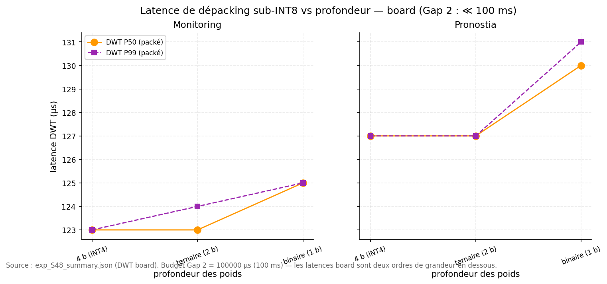

Le bit-packing n'est pas gratuit : il faut dépacker à chaque inférence.

| | non-packé | packé | surcoût |
|---|---|---|---|
| Monitoring | 67 µs | 123 – 125 µs | **≈ +55 µs** |
| Pronostia | 70 µs | 127 – 130 µs | **≈ +55 µs** |

Le surcoût est **constant** et sans effet sur le Gap 2 : on reste trois ordres de grandeur
sous les 100 ms. C'est un arbitrage exploitable : **quelques centaines d'octets de RAM
contre 55 µs**.

Ces deux mesures closent les deux `TODO(dorra)` ouverts au Sprint 47 (noyau bit-packé et
coût du dépacking).

---

# 15. Bloc 2 — à retenir

1. **Le moment compte moins que la calibration.** QAT + PTQ ne bat la PTQ calibrée que de
   4 à 8 millièmes, quand la PTQ naïve, elle, effondre le modèle jusqu'au hasard.
2. **La granularité rachète la profondeur** : le per-channel repousse le décrochage
   (−0.046 → −0.009 à 2 bits) là où le zero-point affine ne rachète rien.
3. **Le gain sub-INT8 est conditionnel au bit-packing** — et cette phrase est une mesure
   `.bss`, pas une hypothèse.
4. **Parité 1.000 partout** : chaque schéma évalué en émulation est reproduit à
   l'identique sur silicium.

---

# Bloc 3 — La RAM, pour de vrai

# 16. Nos chiffres RAM étaient sous-estimés (S49)

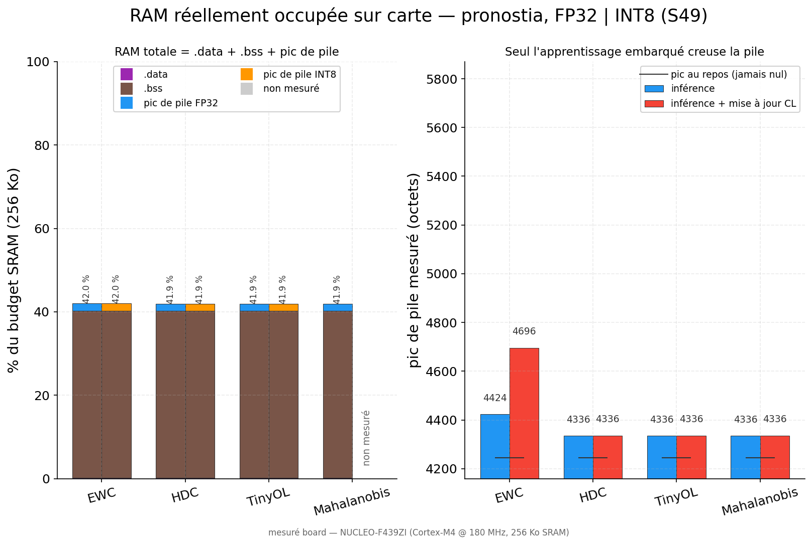

**Correction du compte rendu du 16 juillet.** Toutes nos mesures antérieures ne remontaient
que la section `.bss`. La RAM réellement occupée est :

> **RAM totale = `.data` + `.bss` + pic de pile**

**32 cellules** mesurées (16 carte, 16 PC), invariant vérifié
`total = data + bss + max(pic_inférence, pic_update)`.

Résultat : **40 à 42 % du budget de 256 Ko**, avec `.data` = 460 o et un pic de pile de
4,2 à 4,7 Ko selon la phase. Gap 2 tenu — mais désormais sur la **bonne** quantité.

---

# 17. Deux constats que seule la mesure de pile donne (S49)

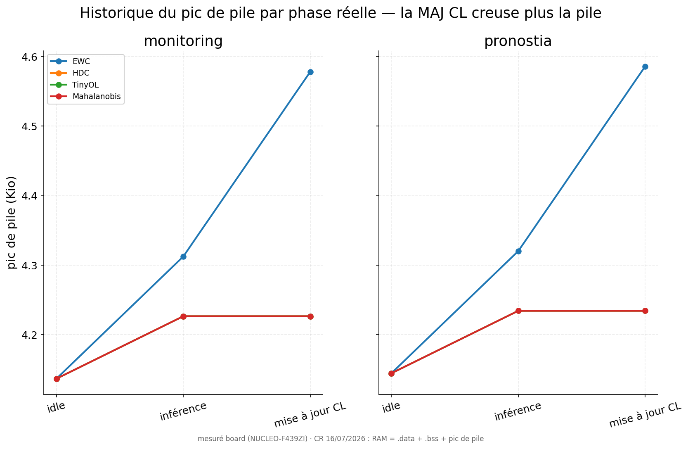

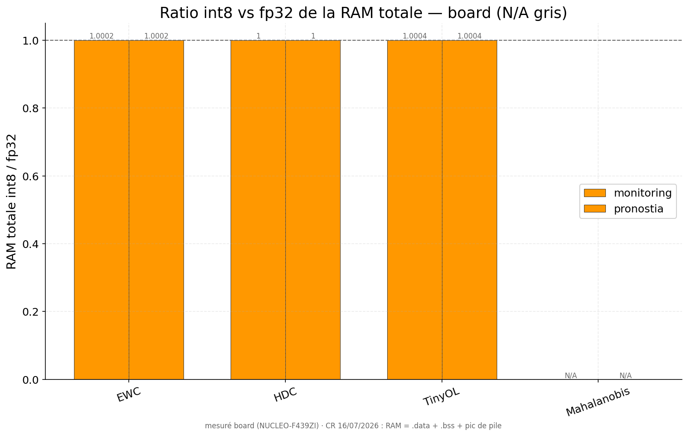

**Constat 1 — le repos n'est pas nul.** Même sans inférence, la pile est déjà à ≈ 4 236 o.
Un budget qui part de zéro est faux dès la première ligne.

**Constat 2 — seul l'apprentissage creuse la pile.** EWC passe de 4 424 o (inférence) à
4 696 o (inférence + mise à jour CL). HDC, TinyOL et Mahalanobis restent plats à 4 336 o :
ils n'ont pas de rétropropagation. *La mise à jour continue a un coût mémoire propre,
mesurable et modeste.*

**Constat 3, et il pèse sur tout le Gap 3** : en `.bss`, **INT8 ≡ FP32** (ratio 1.0002).
La RAM des *poids* est bien divisée par 4 — mais ils ne représentent qu'une fraction de la
RAM *système*.

---

# 18. Bloc 3 — à retenir

- La mesure a **invalidé notre propre méthode** avant d'invalider un résultat. La
  méthode est désormais écrite (`docs/context/ram_measurement.md`) et le rapport
  (`ram_report.md`) est **généré**, jamais rédigé à la main.
- « RAM des poids ÷ 4 » et « RAM système ÷ 4 » sont deux affirmations différentes.
  **La première est vraie, la seconde est fausse** — et c'est la mesure qui le dit.
- Les cellules non mesurables (Mahalanobis INT8 = build de compilation dédié ; PC = proxy
  `tracemalloc`) portent un `na_reason` et restent grises dans les figures.

---

# Bloc 4 — Ce que coûte vraiment une inférence

# 19. Pourquoi l'INT8 est plus lent (S50, carte réelle)

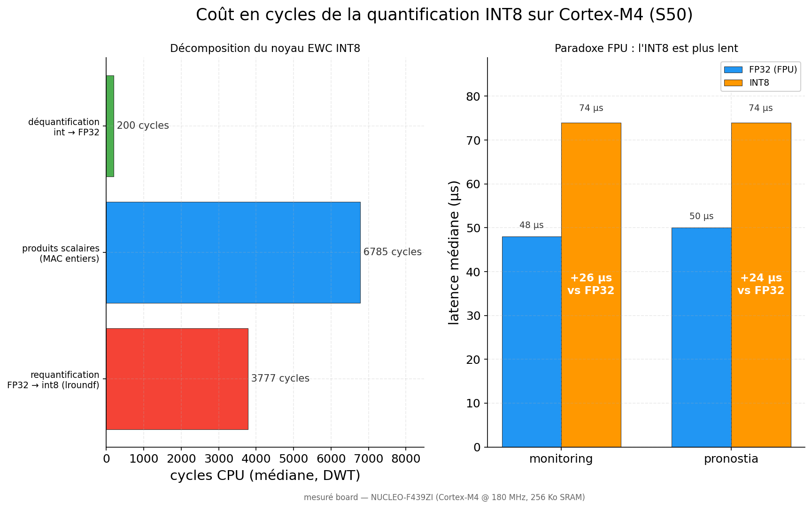

Le paradoxe était connu depuis le Sprint 29 ; il est maintenant **chiffré poste par
poste**, par instrumentation DWT au cycle près (entièrement gardée par
`-DINT8_SEGMENT_PROFILE` : le build par défaut est invariant).

| Poste | Cycles (médiane) |
|---|---|
| Déquantification int → FP32 | ≈ 200 |
| Produits scalaires (MAC entiers) | ≈ 6 785 |
| **Requantification FP32 → int8 (`lroundf`)** | **≈ 3 777** |

**Total INT8 74 µs contre 48 – 50 µs en FP32.** Le MAC entier n'apporte **aucun gain**
face à la FPU du Cortex-M4, et la requantification consomme à elle seule un tiers du
budget. Sur ce cœur, l'INT8 est une opération de **compression mémoire**, pas
d'accélération.

---

# 20. Premier banc énergie — et son anomalie (S50)

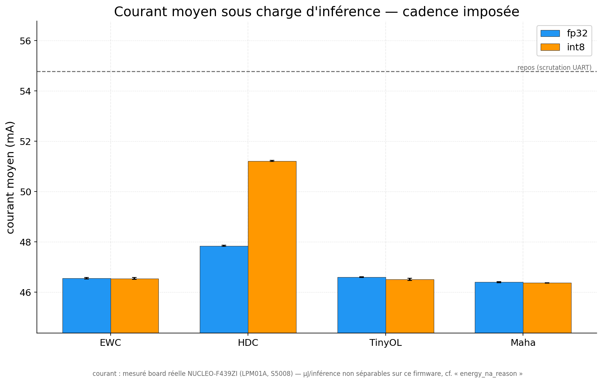

Première campagne avec la sonde **X-NUCLEO-LPM01A**. Méthode : courant moyen à cadence
imposée (100 Hz, fenêtre 10 s, 3 répétitions) — à cadence identique, l'UART et l'hôte sont
communs, donc l'écart entre cellules est imputable au modèle.

**Grille 8/8 mesurée**, dispersion ≤ 0,05 mA. L'ordre des courants suit exactement l'ordre
des latences (Maha 5 µs → 46,4 mA … HDC INT8 1 958 µs → 51,2 mA).

**Mais deux constats de banc ont invalidé le protocole prévu :**

1. la **première acquisition d'une session** est biaisée d'environ +8 mA ;
2. la référence « repos » ressortait **plus haute que tous les régimes de flux**
   (54,78 mA contre 46,4 – 51,2 mA) — les µJ par inférence seraient sortis **négatifs**.

Verdict : µJ = « à mesurer », avec une **raison mesurée**, pas « pas encore fait ».

---

# 21. Sprint 53 — reprendre l'anomalie par la méthode

L'anomalie de S50 pouvait avoir deux causes : un effet physique réel, ou un artefact de
protocole. Un plan contre-balancé repos / charge (rangs conservés, régime établi isolé)
a tranché — **et le verdict est calculé, pas déclaré** :

> `verdict: "artefact_ordre"` — le premier repos de la session mesure 50,130 mA, le
> dernier 39,870 mA. La carte **bascule de niveau de repos au premier flux reçu**
> (−10,06 mA). L'écart négatif du Sprint 50 était la queue de l'établissement de session.

Deux enseignements de banc, désormais outillés :

- toute mesure jette une acquisition de préchauffage (`lpm01a_probe.warmup()`) ;
- un **garde-fou de plausibilité du courant** est posé dans `capture()`, en point
  d'étranglement unique — une carte non alimentée ne peut plus être profilée comme une
  mesure valide.

---

# 22. Débloquer la mesure : endormir l'attente UART (S53)

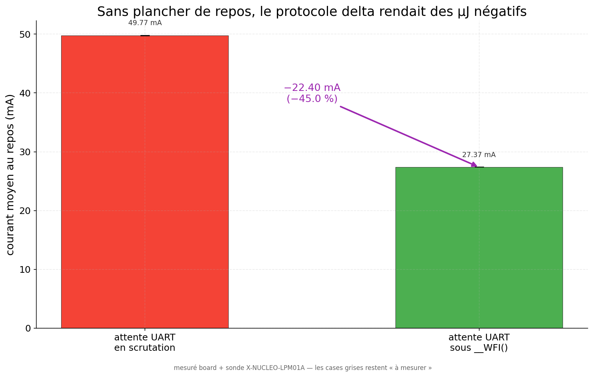

La cause profonde était dans le firmware : l'attente d'une trame UART se faisait en
**scrutation active**. Le « repos » n'était pas du repos, et il n'existait donc **aucun
plancher** pour un protocole différentiel.

Un `__WFI()` gardé par `-DUART_WFI_IDLE` fait tomber le repos de **49,77 mA à 27,37 mA,
soit −45,0 %**. Le protocole delta est débloqué : 8 cellules sur 8 chiffrées.

C'est le prérequis physique de tout ce qui suit — et il illustre un point plus général :
*sur un banc énergie, ce que l'on croit mesurer dépend de ce que le firmware fait quand il
ne fait rien.*

---

# 23. Isoler le calcul du coût de la trame (S53)

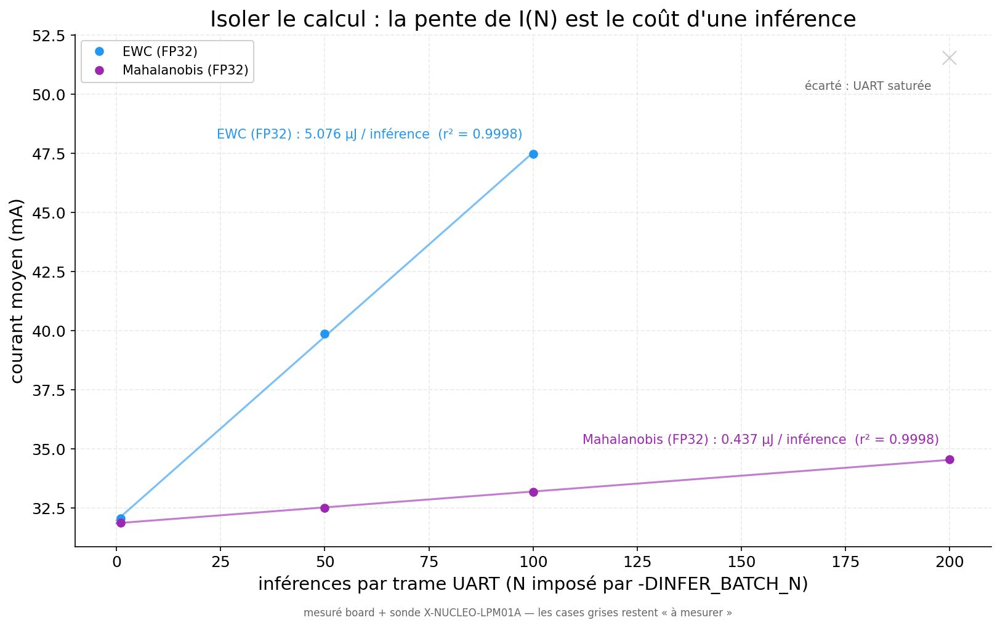

Mesurer une inférence isolée est impossible : la trame UART coûte plus cher que le calcul.
La parade est de faire varier le **nombre d'inférences par trame** (`-DINFER_BATCH_N`) et
de lire la **pente**, l'ordonnée à l'origine absorbant tout le coût fixe.

| Modèle | Énergie par inférence | r² |
|---|---|---|
| EWC (FP32) | **5,076 µJ** | 0,9998 |
| Mahalanobis (FP32) | **0,437 µJ** | 0,9998 |

Contrôle de validité : la **parité de prédiction entre les lots est de 1.000** — le
groupage ne change pas ce que le modèle calcule. Les points où la cadence atteinte tombe
sous 95 % de la cadence demandée sont **écartés** : au-delà, l'UART sature en silence et
la pente serait sous-estimée.

**Autonomie duty-cyclée** qui en découle : ≈ **73 h à 1 Hz sur 2000 mAh** — les 43 h
annoncées au Sprint 50 étaient pessimistes, mesurées sans veille.

---

# 24. Gap 3 côté énergie : la réponse est « non » (S53)

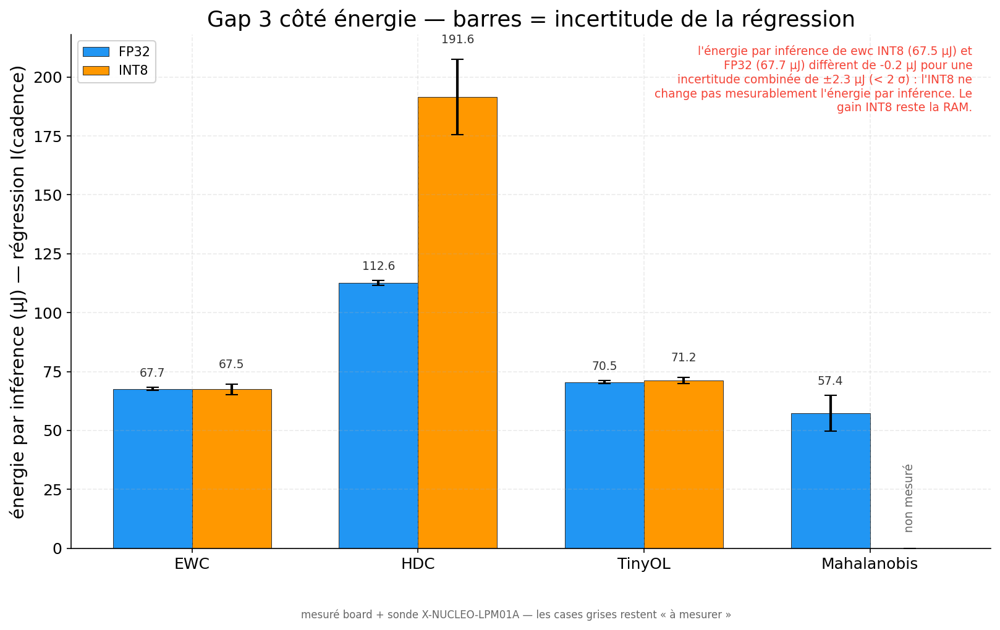

Balayage de cadence, régression pondérée par `1/σ²`, saturation détectée sur la cadence
**atteinte** (et non demandée). Sept cellules mesurées, 0 CRC.

> EWC INT8 **67,47 µJ** vs FP32 **67,65 µJ** — un écart de **−0,18 µJ** pour une
> incertitude combinée de **± 2,34 µJ**. Verdict calculé : `non_significatif`.

**L'INT8 ne change pas mesurablement l'énergie par inférence.** Ajouté au paradoxe de
latence (S29, S50), cela ferme la question :

> **Le gain de l'INT8 est la RAM. Ni la latence, ni l'énergie.**

C'est une conclusion négative, et c'est une contribution : elle contredit l'argumentaire
habituel « INT8 = moins de calcul = moins d'énergie », qui suppose un cœur sans FPU.

---

# 25. Ce qui, lui, change l'énergie : la fréquence (S53)

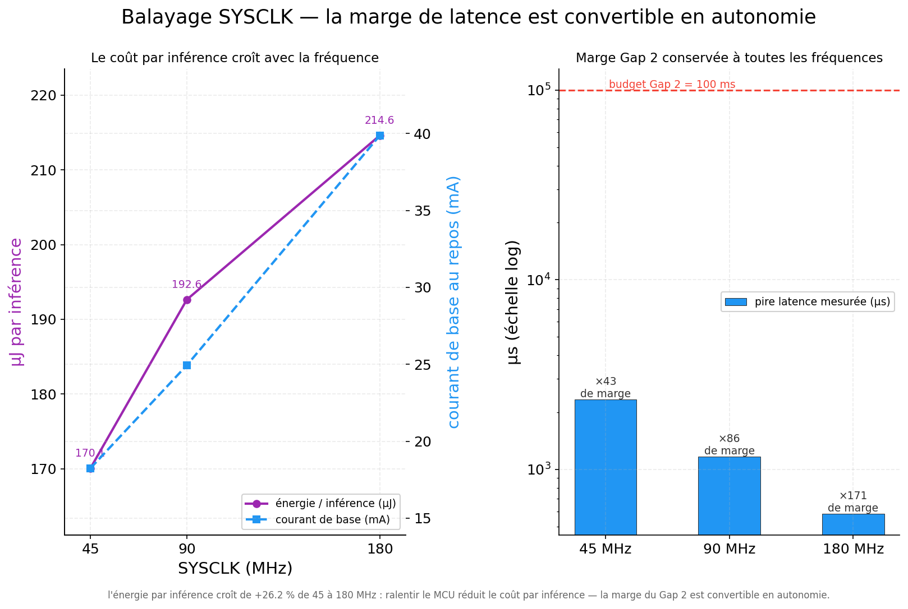

Balayage `-DSYSCLK_MHZ` à 45, 90 et 180 MHz (PCLK1 tenu à 45 MHz pour ne pas toucher au
diviseur UART).

- L'énergie par inférence **croît de +26,2 %** de 45 à 180 MHz (170,05 → 214,61 µJ).
- Le courant de base croît lui aussi fortement (18,2 → 39,9 mA).
- **Le Gap 2 reste tenu à toutes les fréquences** : ×43 de marge à 45 MHz, ×171 à 180 MHz.

> **La marge de latence est convertible en autonomie.** Nous sommes trois ordres de
> grandeur sous le budget des 100 ms : ralentir le cœur est le levier d'énergie que la
> quantification ne nous a pas donné.

*Note de méthode* : `profiling.c` convertissait les cycles DWT avec une fréquence figée —
les latences aux fréquences réduites étaient **sous-estimées d'un facteur 2 à 4**. Corrigé,
build par défaut invariant.

---

# Bloc 5 — Qualité et honnêteté

# 26. Un flag manquant rendait une ligne du manuscrit fausse (S52)

**Le défaut.** `sensor_stream.py` n'attribuait aucun flag UART au modèle TinyOL. Le
firmware retombait donc sur sa branche par **défaut** : Mahalanobis. Les JSON
`exp_S35_board_*_tinyol_*` **dupliquaient** ceux de Mahalanobis sur les 10 paires —
jusqu'au champ `date`. La ligne « TinyOL carte » du tableau 5.1 du manuscrit était fausse.

**Et le défaut en cachait quatre autres**, que seul le flag correct a révélés : gardes de
dimension figées à 5 entrées, aucun exportateur de poids TinyOL, et un débordement de pile
latent (`float recon[EWC_IN]` là où le décodeur écrit `TINYOL_OUT`).

**Après correction, ré-mesure complète, 0 CRC** : parité **44/44** (grille S35) et **45/45**
(grille S32) ; F1 carte 0,9268 (Monitoring), 0,8889 (Pronostia), 0,3000 (CMAPSS),
**0,0000** (Paderborn) ; latence 69 – 148 µs, croissante avec k — la signature d'un
auto-encodeur, désormais visible parce que c'est bien TinyOL qui tourne.

Effet de bord : les 2 échecs Unity « préexistants » tombent. `make test` : **141, 0 échec**.

---

# 27. Sept défauts d'outillage, dont trois produisaient des résultats faux (S53)

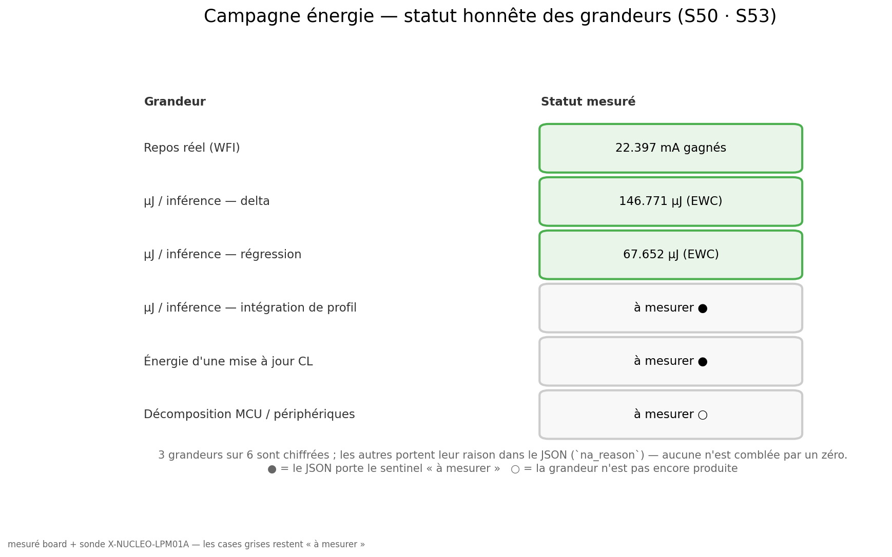

La séance du 7 septembre a corrigé sept défauts. **Trois produisaient des résultats
crédibles et faux** — le pire cas, puisque rien ne les signalait :

1. une **carte non alimentée** profilée comme une mesure valide ;
2. la cellule `maha_int8` **écrite depuis le build FP32** (même classe de bug que le flag
   TinyOL ci-dessus) ;
3. le **biais de première acquisition** qui inversait le signe du delta.

Correctifs structurels : fonctions série du pilote de sonde **sous tests** ; garde-fou de
plausibilité en point d'étranglement unique ; **ajustement unifié** (le balayage SYSCLK
publiait d'autres chiffres que le balayage de cadence — `_linear_fit` supprimé au profit
d'une source unique, cellules recalculées par `--refit` sans remesure) ; et une **règle de
publication arrêtée avant la mesure** pour les différences de pentes.

Ce qui reste « à mesurer », avec sa raison :

- **3ᵉ estimateur (intégration de profil)** — segmentation refusée : 3 792 créneaux
  détectés pour 100 attendus ; diviser par ce dénominateur fabriquerait une énergie.
- **Énergie d'une mise à jour CL** — régressions non publiables. L'isolation à variable
  unique a toutefois **écarté les poids** comme cause (−1,07 ± 0,41 et +1,67 ± 0,75 µA/Hz,
  tous deux plats, contre +20,73 ± 0,21 sur le build de référence) ; la dimension reste
  candidate, le mécanisme n'est **pas établi**.

---

# Bloc 6 — Bilan

# 28. Où nous en sommes, et ce qui reste ouvert

**Acquis mesurés carte réelle depuis juillet**

| Gap | Apport S44 → S53 |
|---|---|
| **Gap 1** | 4 corpus à drift labellisé, dont un à vérité-terrain exacte |
| **Gap 2** | RAM redéfinie et re-mesurée (40 – 42 % du budget) ; latences 5 µs → 2,3 ms selon modèle et fréquence, **toujours ≪ 100 ms** |
| **Gap 3** | Les trois axes de quantification balayés ; **le gain de l'INT8 est la RAM, et elle seule** |

**Trois messages à retenir**

1. *Seule la mesure carte fait foi* — le proxy PC se trompait d'un facteur 45.
2. *Le gain sub-INT8 n'existe que packé* — mesuré sur `.bss`, pas déduit.
3. *L'INT8 ne gagne ni en latence (+50 %) ni en énergie (Δ dans le bruit)* — le levier
   d'autonomie est la **fréquence**, pas la précision.

**Ouvert**

- **S51** — score système composite : spécifié, **non exécuté**.
- **S53** — 3ᵉ estimateur d'énergie (voie B : soudure PA8 → D7) ; énergie d'une mise à
  jour CL ; décomposition MCU / périphériques (câblage séparé).
- **Réglage** des seuils de détection de drift (travail PC, distinct du portage).
# Annexe A — Comment on mesure une énergie

> Bloc optionnel, à dérouler si la question « d'où viennent ces µJ ? » est posée.
> Dix figures, ~12 min. Chaque schéma de principe est étiqueté comme tel ; toute valeur
> chiffrée vient de `experiments/exp_S53_*`.

---

# A1. Ce que la sonde mesure — et ce qu'elle ignore

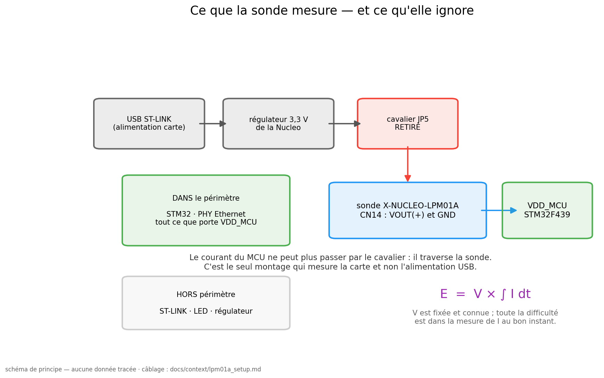

**Le montage.** Le cavalier `JP5` de la Nucleo relie normalement le régulateur 3,3 V au
`VDD_MCU`. On le **retire** et on insère la sonde à sa place : le courant du MCU n'a plus
d'autre chemin que la sonde.

**Le périmètre est donc une décision de câblage, pas une hypothèse.** Sont comptés le
STM32 et tout ce que porte `VDD_MCU` — PHY Ethernet inclus. Sont exclus le ST-LINK, les
LED et le régulateur.

`E = V × ∫ I dt`. La tension est fixée et connue ; toute la difficulté du sprint tient
dans la mesure de `I` **au bon instant**.

---

# A2. Deux modes d'acquisition — il ne nous en reste qu'un

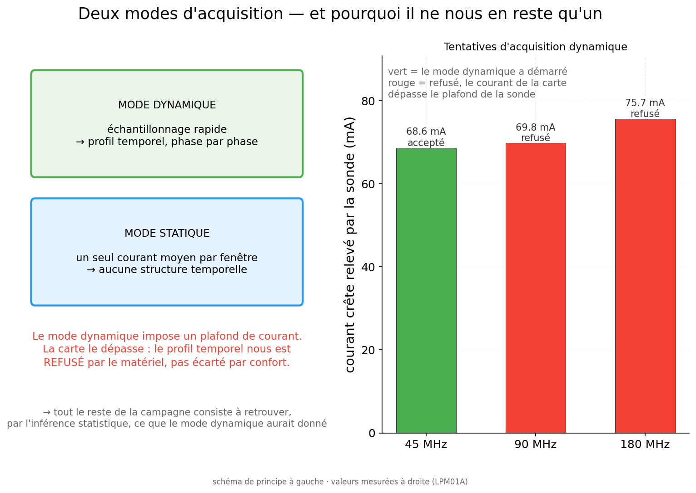

Le LPM01A sait faire deux choses :

- **mode dynamique** — échantillonnage rapide, donc un **profil temporel** : on verrait
  l'inférence se détacher du repos ;
- **mode statique** — un seul courant moyen par fenêtre, sans aucune structure temporelle.

Le mode dynamique impose un plafond de courant que **la carte dépasse** : refusé à 180 et
à 90 MHz. Le profil temporel nous est donc interdit **par le matériel**, ce n'est pas un
choix de confort.

**Conséquence de méthode** : tout le reste de la campagne consiste à retrouver, par
l'inférence statistique, ce que le mode dynamique aurait donné directement.

---

# A3. Pourquoi une inférence ne se mesure pas

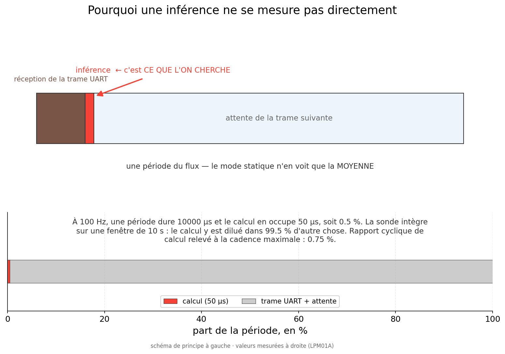

À 100 Hz, une période dure 10 000 µs ; l'inférence EWC en occupe **50**, soit **0,5 %**.
La sonde intègre sur une fenêtre de 10 s.

Autrement dit : **le signal cherché représente un demi-pour-cent de ce que l'instrument
rapporte**, et les 99,5 % restants sont de la réception UART et de l'attente. Aucune
lecture directe n'est possible — il faut construire un estimateur.

---

# A4. Trois estimateurs, trois valeurs — et l'écart est un résultat

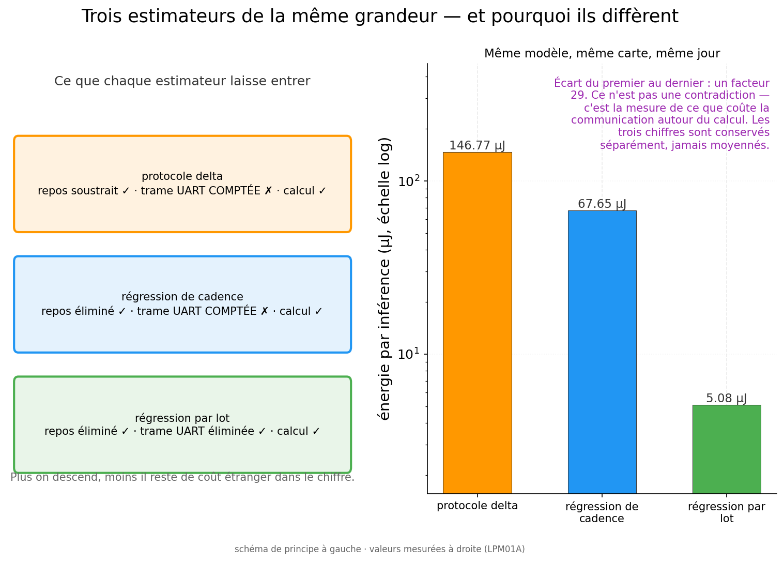

La **même** grandeur (énergie d'une inférence EWC), sur la même carte, le même jour :

| Estimateur | Valeur | Ce qu'il laisse entrer |
|---|---|---|
| protocole delta | **146,77 µJ** | trame UART comptée |
| régression de cadence | **67,65 µJ** | trame UART comptée, repos éliminé |
| régression par lot | **5,08 µJ** | trame et repos éliminés |

Un facteur **29** entre le premier et le dernier. **Ce n'est pas une contradiction** :
c'est la mesure de ce que coûte la communication autour du calcul.

C'est pourquoi les trois chiffres sont conservés **séparément** dans les JSON et **jamais
moyennés** — leur comparaison est le contrôle de validité de la campagne. Un chiffre
d'énergie n'a de sens qu'accompagné de son estimateur.

---

# A5. Méthode 1 — le protocole delta

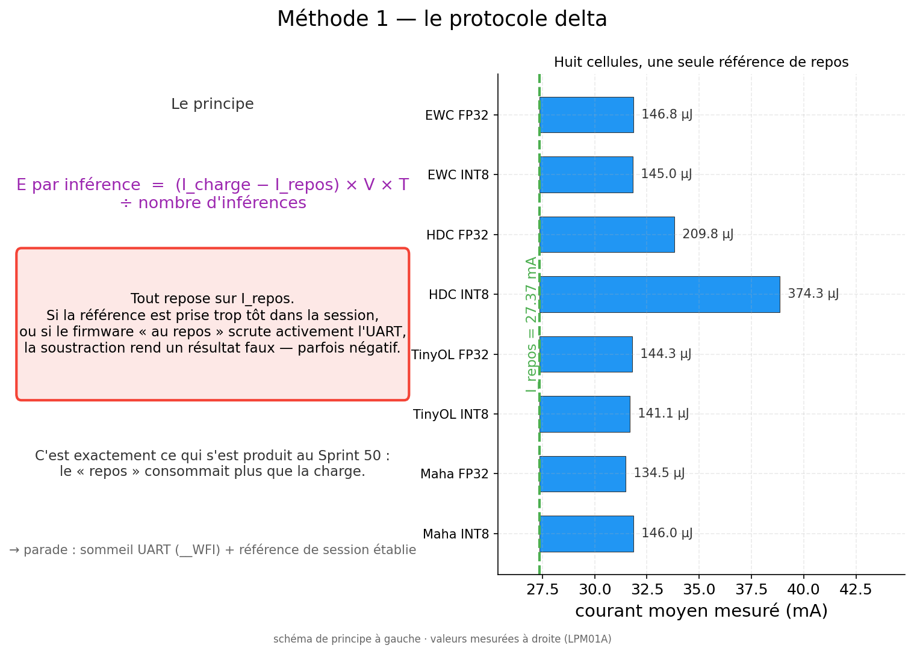

`E = (I_charge − I_repos) × V × T ÷ N`. Simple, et **entièrement suspendu à `I_repos`**.

C'est exactement ce qui a fait échouer le Sprint 50 : la référence de repos, prise en tête
de session et sur un firmware qui scrutait l'UART, ressortait **au-dessus** de la charge.
La soustraction rendait des µJ négatifs.

Parade : sommeil UART, et référence prise sur une **session établie**.

---

# A6. Méthode 2 — la pente de I(cadence)

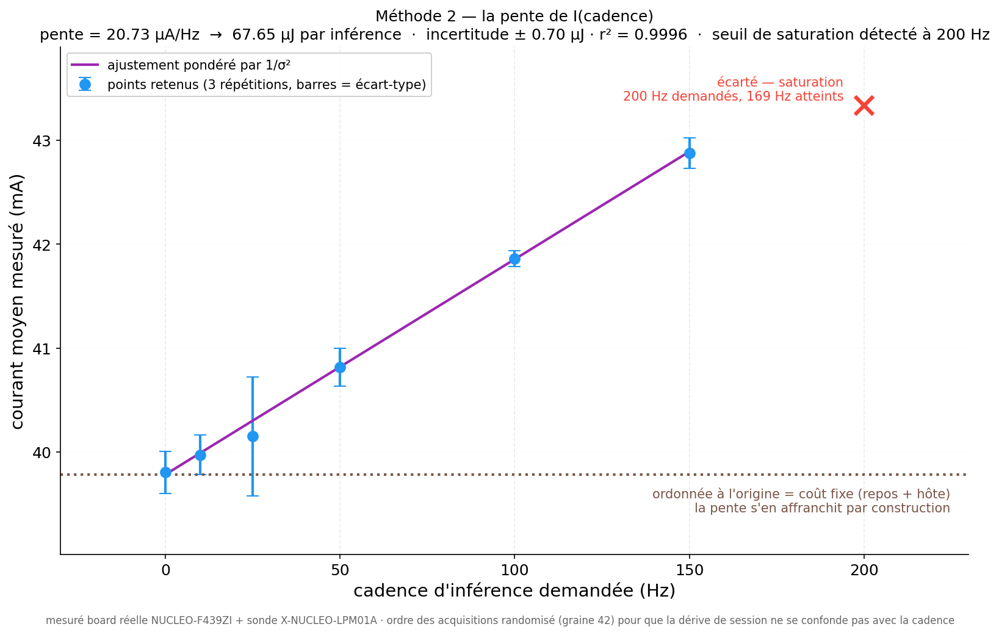

On fait varier la cadence et on lit la **pente**. Tout ce qui ne dépend pas de la cadence
— repos, hôte, dérive lente — se retrouve dans l'**ordonnée à l'origine** et disparaît de
la pente par construction. On n'a plus besoin de connaître `I_repos`.

Trois précautions rendent la pente crédible :

1. **3 répétitions par point**, dont l'écart-type pondère l'ajustement (`1/σ²`) ;
2. **l'ordre des cadences est tiré au sort** (graine 42) — sans quoi la dérive de session
   se lirait comme un effet de la cadence ;
3. **la saturation est détectée sur la cadence atteinte**, pas demandée : à 200 Hz la carte
   n'en tient que 169, le point est écarté (sinon la pente serait sous-estimée).

Résultat : **67,65 ± 0,70 µJ**, r² = 0,9996.

---

# A7. Méthode 3 — la régression par lot

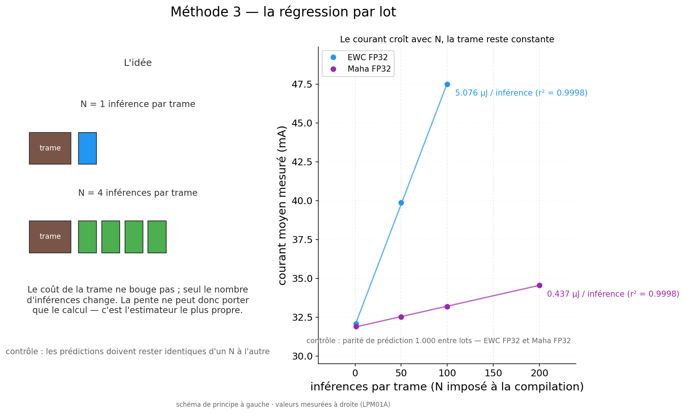

On garde la cadence de trames constante et on fait varier le **nombre d'inférences par
trame** (`-DINFER_BATCH_N`). Le coût de la trame ne bouge plus : la pente ne peut porter
que le calcul. C'est l'estimateur le plus propre.

**EWC 5,076 µJ · Mahalanobis 0,437 µJ**, r² = 0,9998, et un contrôle qui compte :
la **parité de prédiction entre lots vaut 1.000** — grouper les inférences ne change pas
ce que le modèle calcule.

---

# A8. Quatre pièges du banc, mesurés puis neutralisés

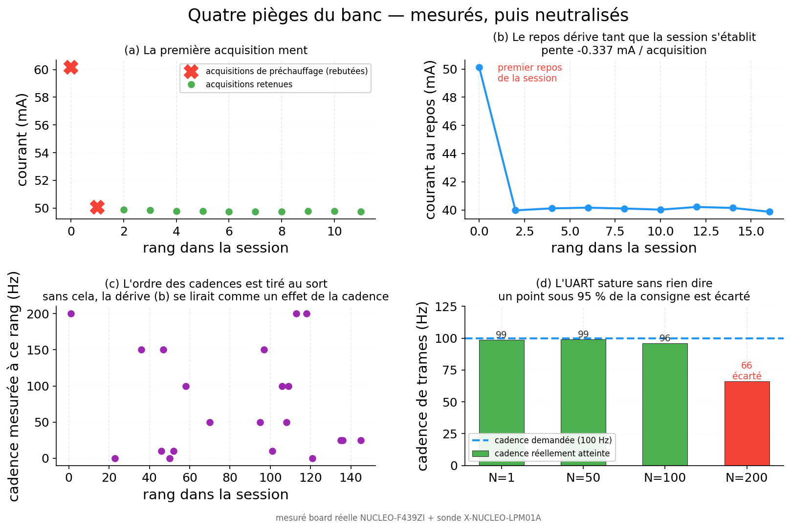

| Piège | Ce qu'on observe | Parade |
|---|---|---|
| (a) la première acquisition ment | ~60 mA au lieu de ~50 | préchauffage systématiquement rebuté |
| (b) le repos dérive à l'établissement | 50 → 40 mA sur une session | référence sur session établie |
| (c) l'ordre confond les effets | — | cadences tirées au sort |
| (d) l'UART sature en silence | 100 Hz demandés, 66 atteints | point écarté sous 95 % de la consigne |

Chacun de ces pièges est un mécanisme par lequel un banc **produit un chiffre crédible et
faux**. Trois d'entre eux nous ont effectivement piégés avant d'être identifiés.

---

# A9. « Repos » est une définition, pas un état

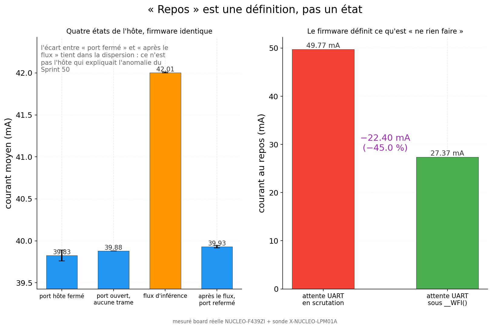

À gauche, quatre états de l'hôte à firmware identique : port fermé, port ouvert sans
trame, flux, puis retour au repos. L'écart entre « port fermé » et « après le flux » tient
dans la dispersion — **ce n'était donc pas l'hôte** qui expliquait l'anomalie du
Sprint 50.

À droite, la vraie cause : le firmware. En scrutation active, « ne rien faire » coûte
**49,77 mA** ; sous `__WFI()`, **27,37 mA**, soit **−45 %**.

> Sur un banc énergie, ce que l'on croit mesurer dépend de ce que le firmware fait
> **quand il ne fait rien**.

---

# A10. Ce que la chaîne permet enfin de conclure

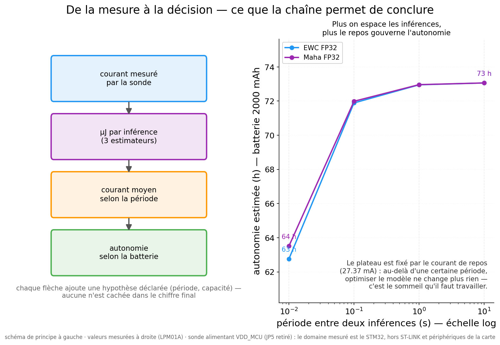

Courant mesuré → µJ par inférence → courant moyen selon la période → autonomie selon la
batterie. Chaque flèche ajoute une hypothèse **déclarée** (période de scénario, capacité) ;
aucune n'est cachée dans le chiffre final.

**≈ 73 h à 1 Hz sur 2000 mAh.** Et surtout, un enseignement de conception : la courbe
**plafonne**. Au-delà d'une certaine période, l'autonomie est fixée par le courant de repos
(27,37 mA) et non par le modèle.

> Optimiser le modèle ne sert plus à rien passé ce point : **c'est le sommeil qu'il faut
> travailler.** C'est aussi ce qui remet en perspective le résultat du bloc 4 — l'INT8 ne
> touche ni la latence ni l'énergie, mais la fréquence et la veille, elles, sont des
> leviers mesurés.
